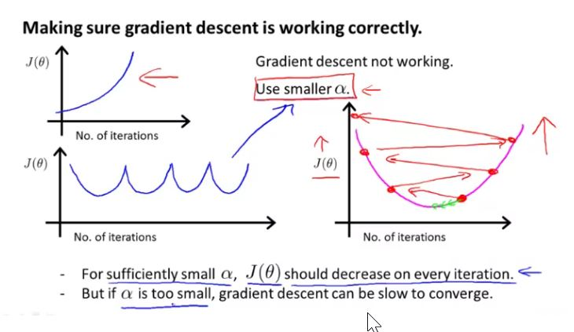

## Multivariate Linear Regression

In the above example, Multivariate hypothesis can be understood in way that price of the house is 80K and its price increases by a factor of 0.1 with the size of the house similarly no of floor and bedroom also have a contributing factor on overall price of the house and at the end, depending on age price of the house decreased by a factor of 2 in age of the house.

### Gradient Descent for Multiple Variables

Cost function for multiple variables is:
$$ J(\theta_0, \theta_1,...,\theta_n) = \frac{1}{2m}\sum_{i=1}^{m}{(h_\theta(x^{i}) - y^{i})}^2 $$

**Gradient Descent:**
Repeat {

$$ \theta_j := \theta_j - {\alpha} \frac {\partial}{\partial{\theta_j}}{J(\theta_0, \theta_1,...,\theta_n)}$$
(simultaneously update for every j = 0,...,n)

Repeat until convergence: {

$$ \theta_j := \theta_j - \alpha \frac{1}{m}\sum_{i=1}^{m}{(h_\theta(x^{i}) - y^{i})}{x_j}^{(i)} $$ for j := 0...n

### Gradient Descent in Practice - Feature Scale
if the range of variables $ x_i $ are hugely varying, then gradient descent will take very long time to get to the minima as can be understood in the following example. to avoid this, it is recommended to normalize the variables. 

We can speed up gradient descent by having each of our input values in roughly the same range. This is because θ will descend quickly on small ranges and slowly on large ranges, and so will oscillate inefficiently down to the optimum when the variables are very uneven.

Using standard deviation and range will provide different results. in programming standard deviation is used while in practice, using range is more prevalent.

It is prudent to use the graph to find whether gradient descent is working (known as debugging gradient descent) instead of automatic convergence test.

### Features and Polynomial Regression
1. Sometimes it is better to define a feature yourself instead of using provided features, Using this one may model non-linear problems as well. example

  

2. You can also modify a feature if the data points follow a polynomial curve. features $ x_i$ can be replaced by $ {x_i}^2$ to fit a quadratic curve into a linear one. 

   It helps if you know the equation of curve your data points seems to follow so that you can modify the features to fit the data points. in the following example, following hypothesis seems to best fit the curve $$ h_\theta(x) = \theta_0 + \theta_1 (size) + \theta_2\sqrt{(size)} $$

   One thing to keep in mind is that if you choose your features this way than feature scaling becomes very important.

   