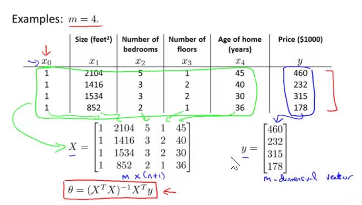
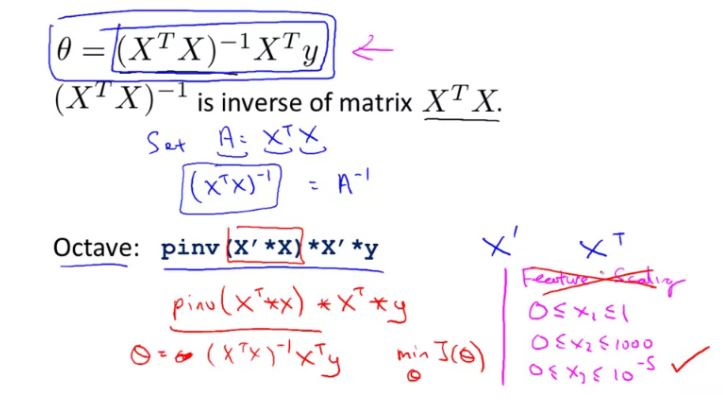
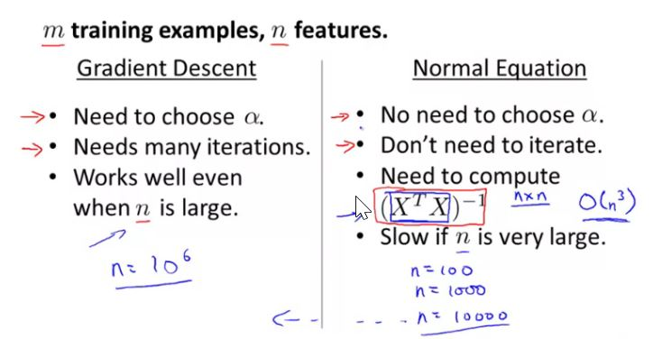
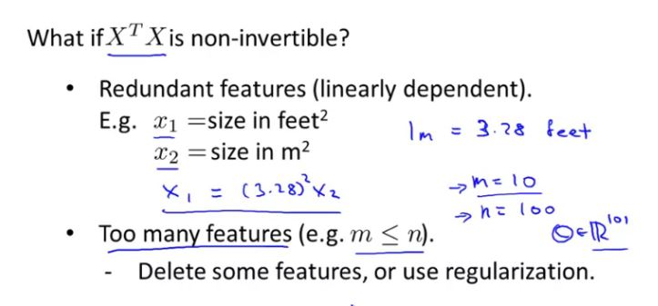

## Normal Equation

When we use normal equation, feature scaling is not required

Time complexity of Gradient descent is 𝑂(𝑘𝑛2)O(kn2)

The reason we use `pinv` (pseudo inverse) instead of `inv` in octave is that later can not handle the non-invertible matrix.

