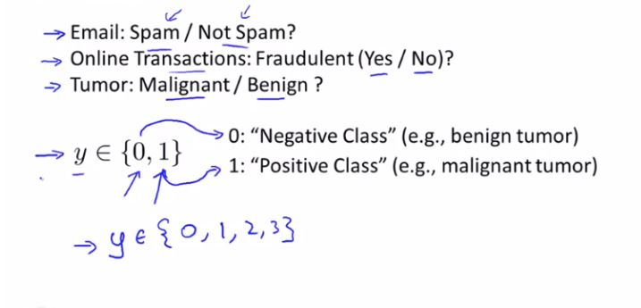
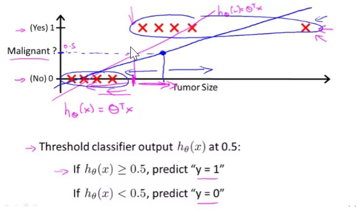
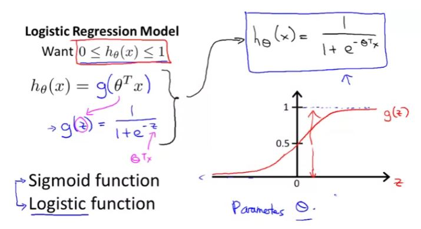
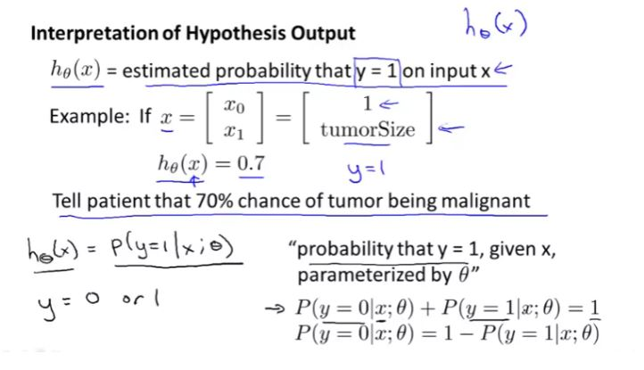
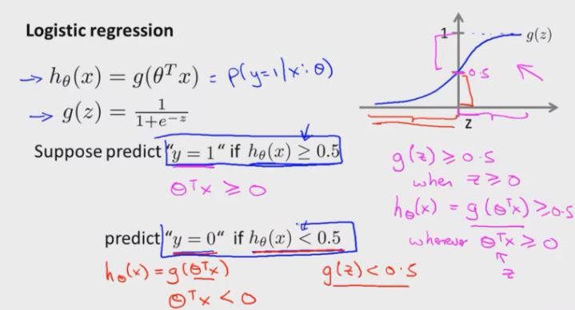
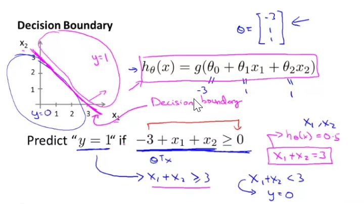
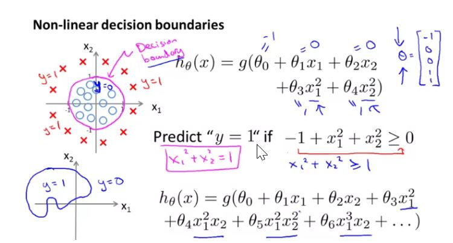

## Logistics Regression

## Classification

To attempt classification, one method is to use linear regression and map all predictions greater than 0.5 as a 1 and all less than 0.5 as a 0. 

However, this method doesn't work well because classification is not actually a linear function. Linear regression does not properly fit the classification problem, only one data point can result in an erroneous result

We could approach the classification problem ignoring the fact that y is discrete-valued, and use our old linear regression algorithm to try to predict y given x. 

However, it is easy to construct examples where this method performs very poorly. Intuitively, it also doesn’t make sense for $h_\theta(x)$ to take values larger than 1 or smaller than 0 when we know that y ∈ {0, 1}. To fix this, let’s change the form for our hypotheses $h_\theta (x)$ to satisfy $0\leq h_\theta(x) \leq1$ This is accomplished by plugging $\theta^Tx$ into the Logistic Function.

The function g(z), shown here, maps any real number to the (0, 1) interval. 
$h_\theta(x)$ will give us the probability that our output is 1.

### Decision Boundary

