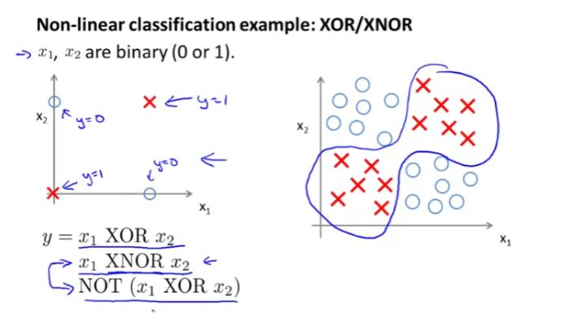
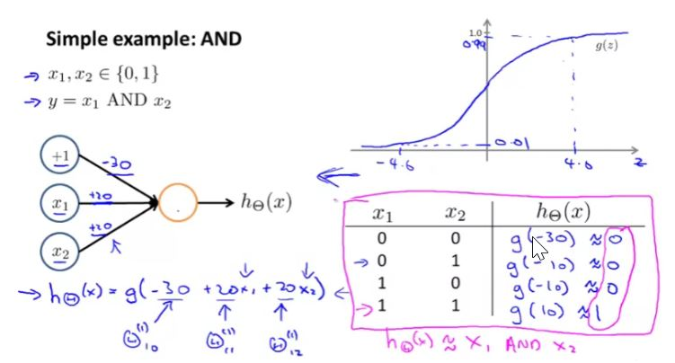
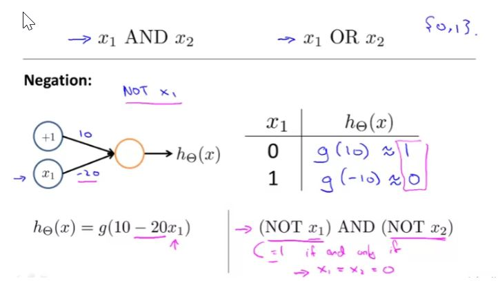
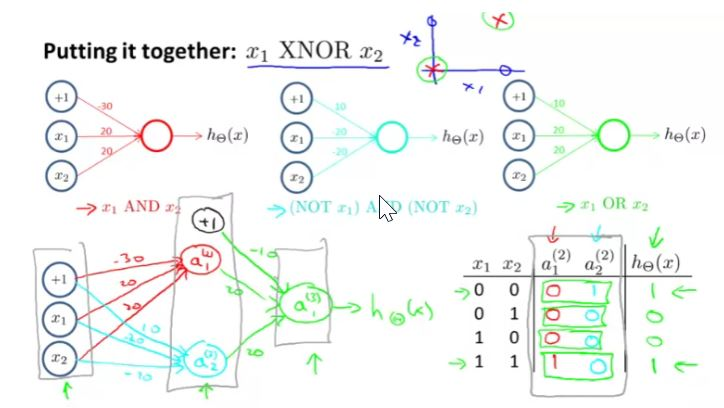
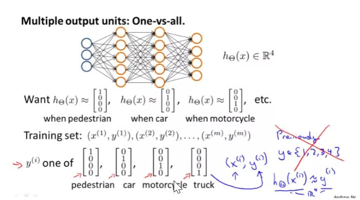

## Model Representation I

### Examples and Intuitions I

AND: $ \Theta ^{(1)} = \begin{bmatrix} -30 & 20 & 20\end{bmatrix} $

NOR: $ \Theta ^{(1)} = \begin{bmatrix} 10 & -20 & -20\end{bmatrix} $

OR: $ \Theta ^{(1)} = \begin{bmatrix} -10 & 20 & 20\end{bmatrix} $

### Example and Intuitions II

We can combine these to get the XNOR logical operator

$ \begin{bmatrix} x_0 \\ x_1\\ x_2\end{bmatrix} \rightarrow \begin{bmatrix} a_1 ^ {(2)} \\ a_2 ^ {(2)}\end{bmatrix} \rightarrow \begin{bmatrix} a ^ {(3)} \end{bmatrix} \rightarrow {h_\theta}(x)$

For the transition between first and second layer, we'll use a $\Theta^{1}$ matrix that combines the values for AND and NOR:
$ \Theta ^ {(1)} = \begin{bmatrix} -30 & 20 & 20 \\ 10 & -20 & -20  \end{bmatrix}$ 

For the transition between the second ad third layer, we'll use a $\Theta ^ {2}$  matrix that uses the value of OR:
$ \Theta ^ {(2)} = \begin{bmatrix} -10 & 20 & 20 \end{bmatrix} $

Lets write out the values for all our nodes:

$ a ^ {(2)} = g({\Theta ^ {1} \cdot x}) $

$ a ^ {(3)} = g({\Theta ^ {2} \cdot a ^ {(2)}}) $

$ h_\Theta{x} = a ^ {(3)} $

### Multiclass Classification

In this case, resulting hypothesis for one set of inputs may look like:

$ h_\Theta {(x)} = \begin{bmatrix} 0010 \end{bmatrix} $

