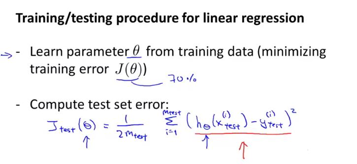

## Deciding What to Try Next

## Evaluating your hypothesis

It is advisable to randomly select 70% and 30% data points before allocating it to training and testing data sets.

The average test error in logistics regression for the test set is: 

Test Error = $ \frac{1}{m_{test}}\sum_{i=1}^{m_{test}}err(h_\Theta(x_{test}^{(i)}), y_{test}^{(i)}) $

## Model Selection and Train/Validation/Test Sets

In case of overfitting, the error of the parameters as measured on the training set data (the training error $J(\theta)$ is likely to be lower than the actual generalization error.

The problem with the model selection is that if we choose a model based on the training set (5 degree polynomial in this case), it will definitely be best model for the training set but it may not generalize to the test set. 

We can now calculate three separate error values for the three different sets using the following method:

1. Optimize the parameters in $\Theta$ using the training set for each polynomial degree.
2. Find the polynomial degree d with the least error using the cross validation set.
3. Estimate the generalization error using the test set with $J_{test}{(\Theta^{(d)})}$.

This way, the degree of the polynomial d has not been trained using the test set.

