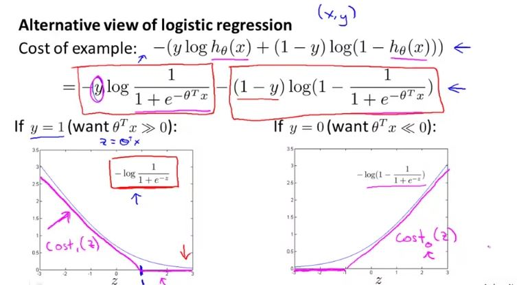
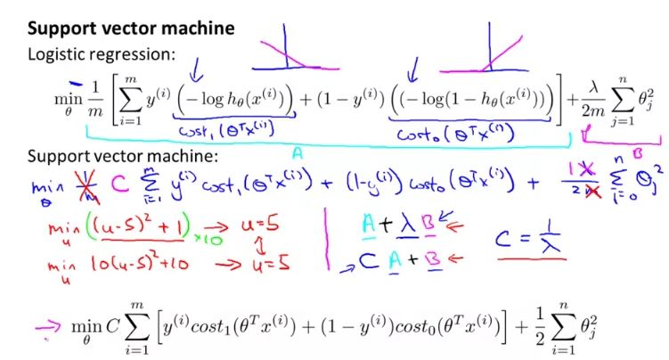
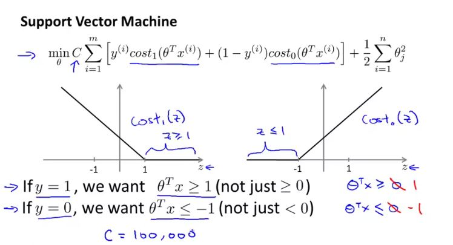
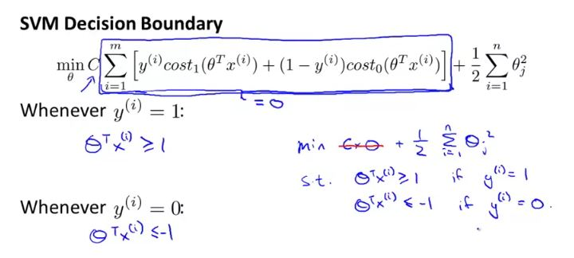
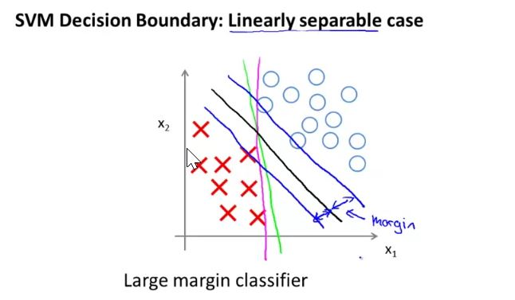
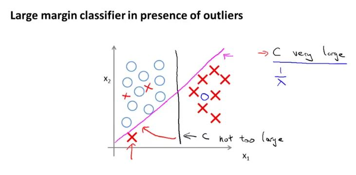
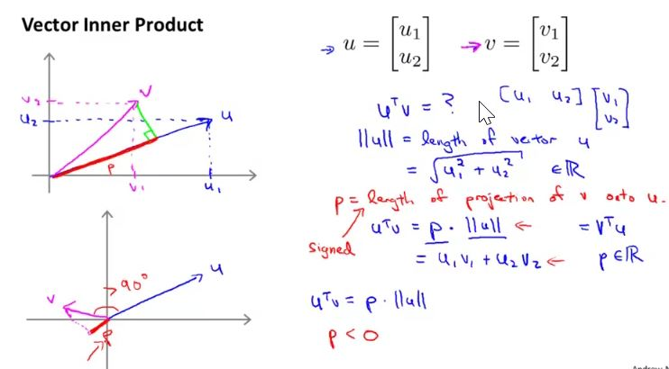
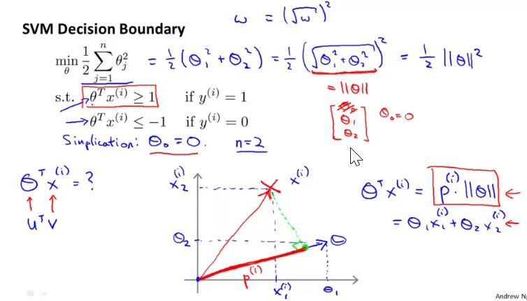

## Optimization Objective

Taking logistics regression cost function and creating two different cost functions for each value of y i.e. {0, 1}, $Cost_1{(z)}$ for y = 1 and $Cost_0{(z)}$ for y = 0

For support vector machine, instead of a curved graph we will have a graph with sharp point as show in the figure below:

Plugging the two cost function in the logistics regression cost function, we will get cost function for the support vector machine

## Large Margin Intuition

When value of C is very large, first part of the equation has to be close to 0 so as to minimize the cost function which will happen when $\theta^Tx \geq 1$ for y = 1 

if C is not very large, then classifier does a better job ignoring the outliers. 

 ## Mathematics Behind Large Margin Classification

if we consider green line to be our decision boundary in left graph (Note: $\theta$ will be 90 degree from the decision boundary), then our $p^i$ will be very small and to compensate that $||\theta||$ will have to very large. 

Since we want the projections of positive and negative examples onto theta to be large, and the only way for that to hold true is if surrounding the green line, there is a large margin

