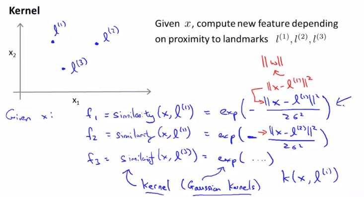

## Kernels I

$||x-l^{(1)}||$ is the Euclidian distance between x and $l^1$ 

**Plotting values of $f^1 on$ $l^1$**

let's have an example x near $l^1$, in this case $f^1$ will be equal to 1 and $f^2$ and $f^3$ will be equal to 0 as x is far from $l^2$ and $l^3$. In this way whenever feature x is near $l^i$, it will predict y = 1, and so a non-linear decision boundary will be formed around the landmarks.

## Kernels II

Advanced optimization techniques that are available for SVM with kernels are not available for other algorithm such as logistics regression. Though it can be implemented, it will not be computationally efficient. 

## Using an SVM

- For SVM, you don't need to worry about local minima, it generate convex cost function.

