## Unsupervised Learning - Introduction

Unsupervised learning is applicable to the areas where we don't have y values, where training set only contains: ${x^{(1)}, x^{(2)}, x^{(3)}, ..., x^{(m)}}$

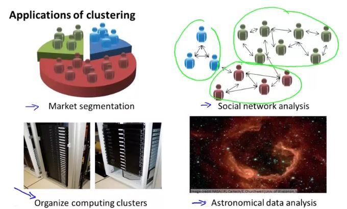

## K - Mean Algorithm

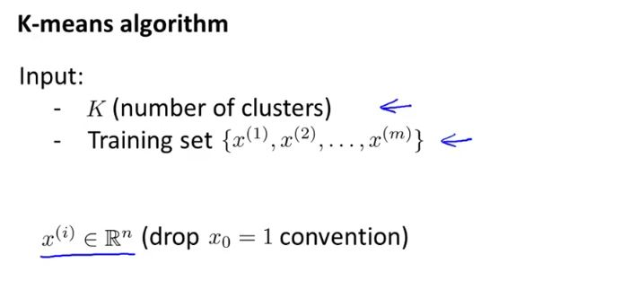

 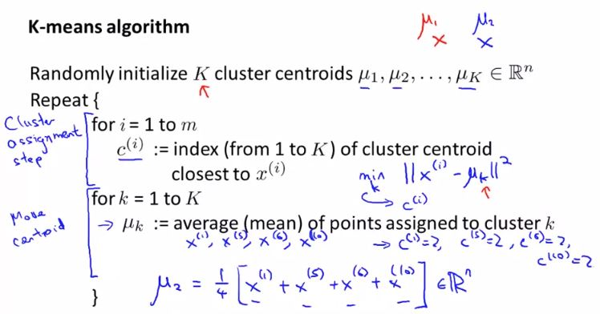

Images are following in clockwise direction in the following depiction

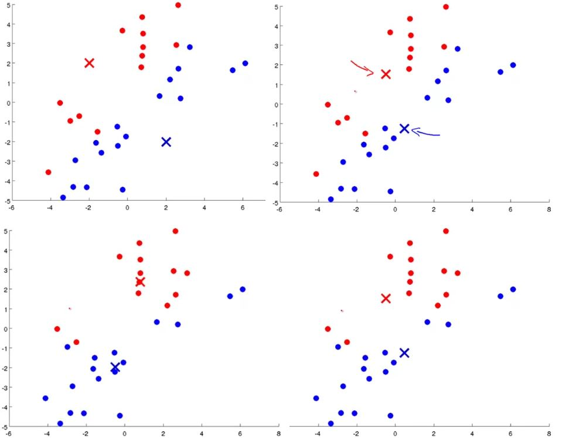

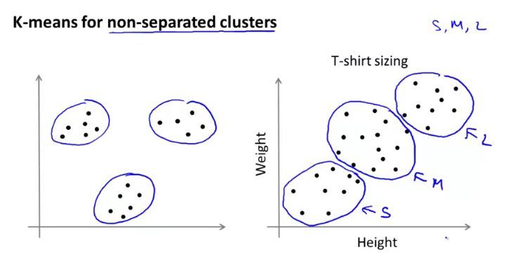

## Optimization Objective

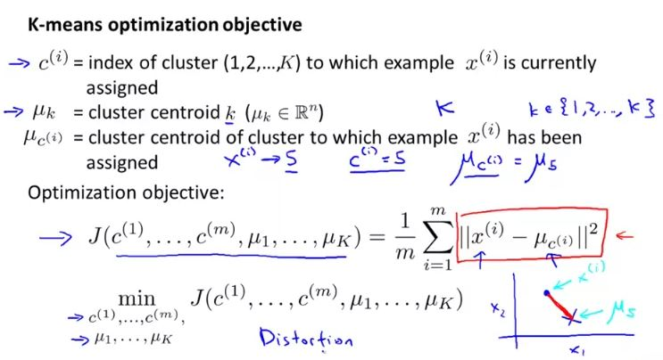

If we analyze the repeat loop in the algorithm as mentioned above, we find two steps:

1.  Cluster assignment step - which basically minimizes the cost function with respect to $C^{(1)}, C^{(2)}, C^{(3)}, ..., C^{(n)}$ while holding $\mu^{(1)}, \mu^{(2)},..., \mu^{(k)}$ fixed.
2. Move centroid step - chooses the values of $\mu$ that minimized $J(...)$ with respect to $\mu^{(1)}, \mu^{(2)},..., \mu^{(k)}$.

## Random Initialization

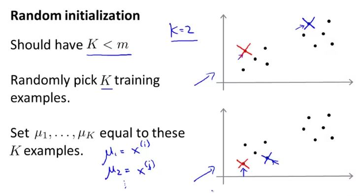

K-mean can sometime get stuck to local optima of cost function.

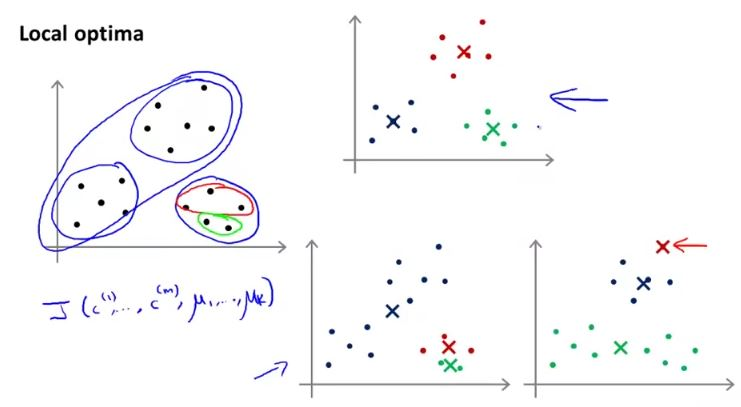

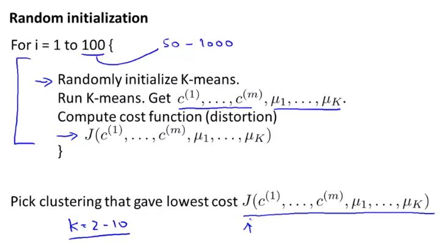

If K is small number (2 - 10), then checking for cost function multiple times may provide a better clustering centroid, however if K is much greater than 10 like 100, then having multiple random initialization may not make a huge difference.

## Choosing the number of Clusters

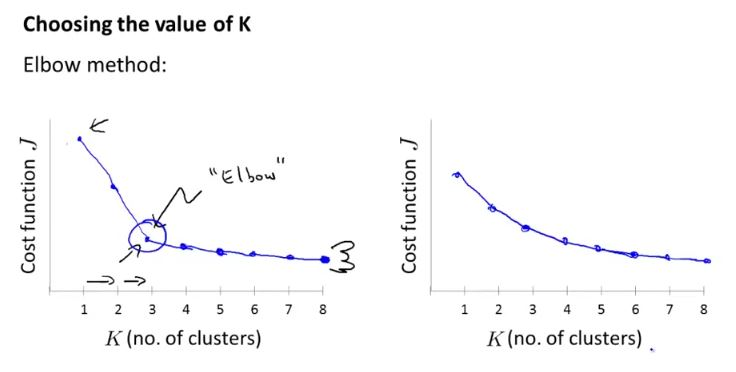

Elbow method is worth the shot but it may not provide clear number of clusters every time.

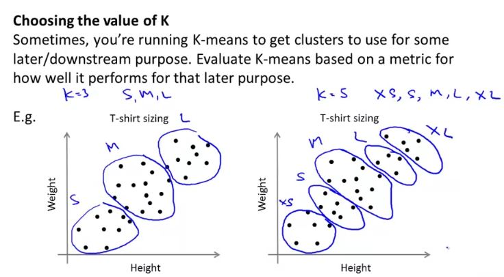

