## Predicting Movie Ratings

### Problem Formulation

 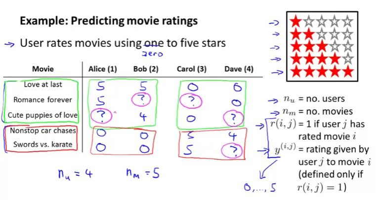

### Content Based Recommendations

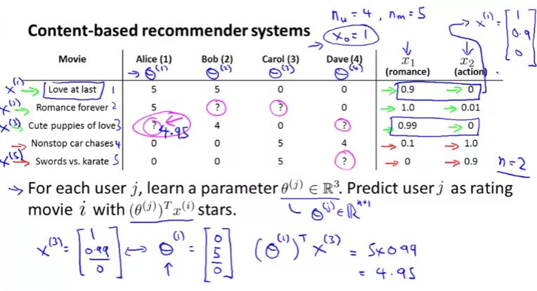

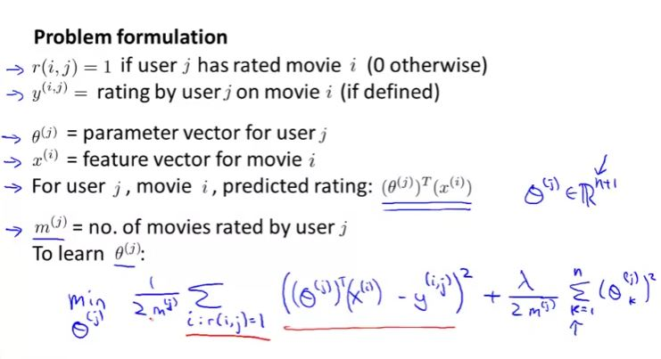

To simplify the cost function we will om it $m_j$

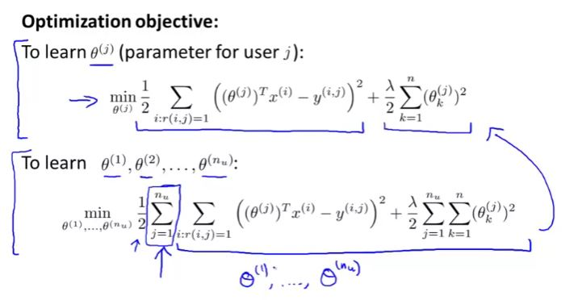

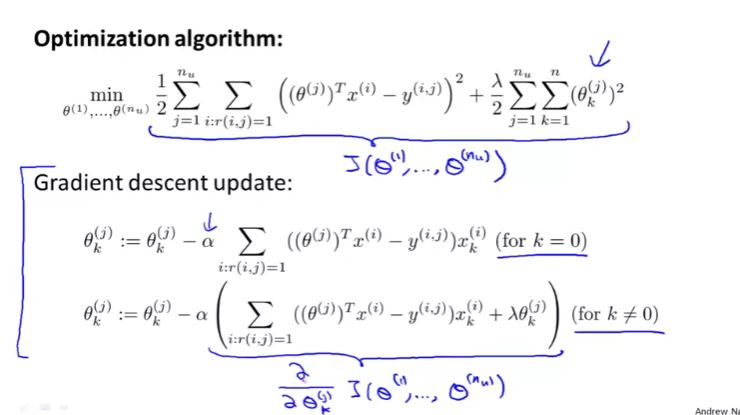

### Collaborative Filtering

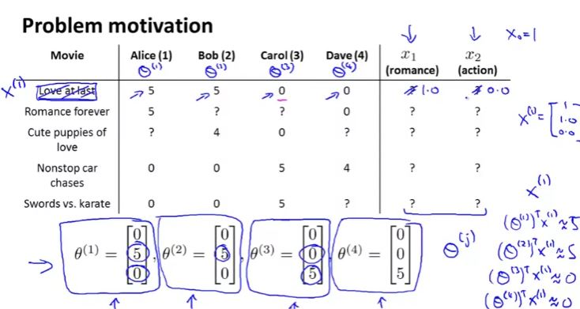

In the earlier chapters, we assume features parameter. To actually get the features, we need to work backwardly from the theta values for each users and find the feature which will result in the rating for movies for each users

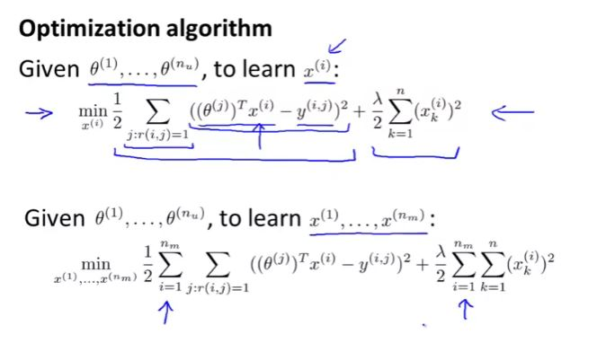

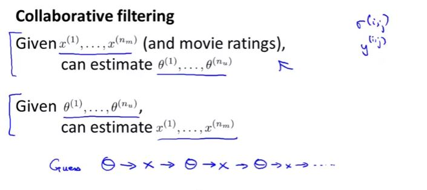

### Collaborative Filtering Algorithm

There is no reason to hard code $x_0$ as 1 as the algorithm is also learning the features, if the problem requires $x_0$ to be 1, algorithm will accommodate that. That means that both $x$ and $\theta$ will be an $R^n$ matrix

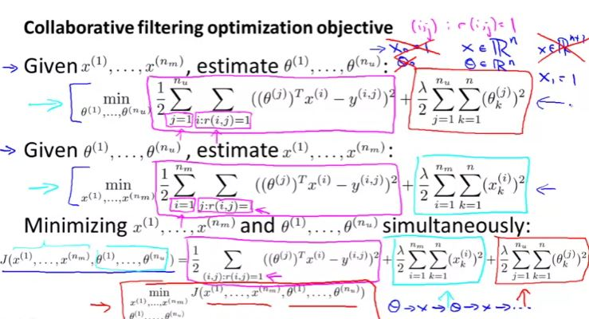

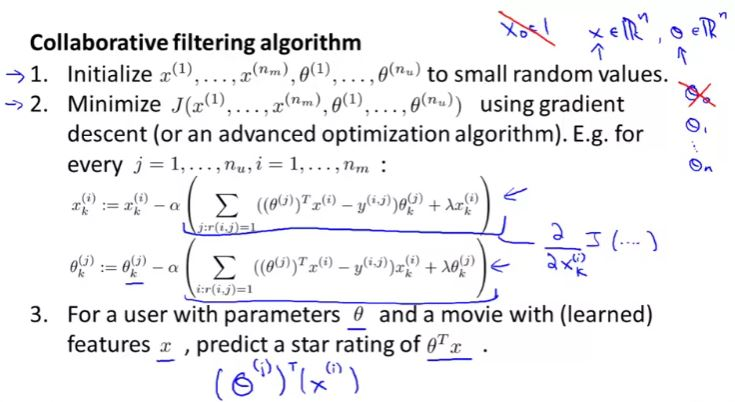

### Vectorization: Low Rank Matrix Factorization

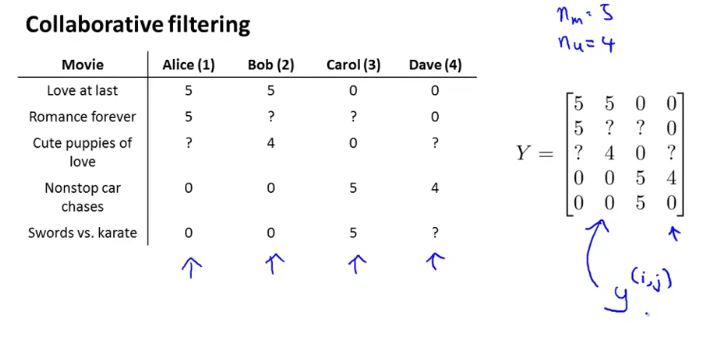

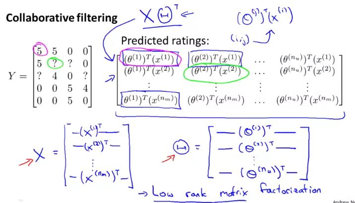

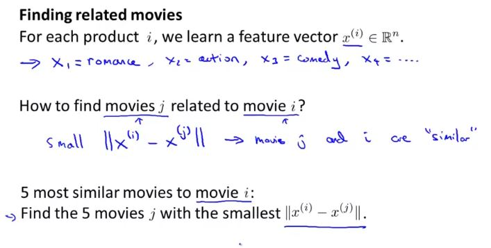

### Implementation Detail: Mean Normalization

For a user who has not rated any of the movies, first term of the cost function will be 0, and minimization function will return theta matrix as 0 as well. Now given the 0 theta vector, all rating prediction will also be 0, which is counter-intuitive. hence different method is required for the user which has not rated any movies yet.

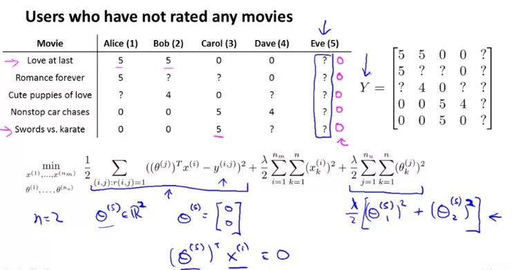
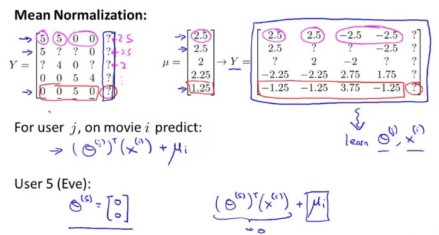

