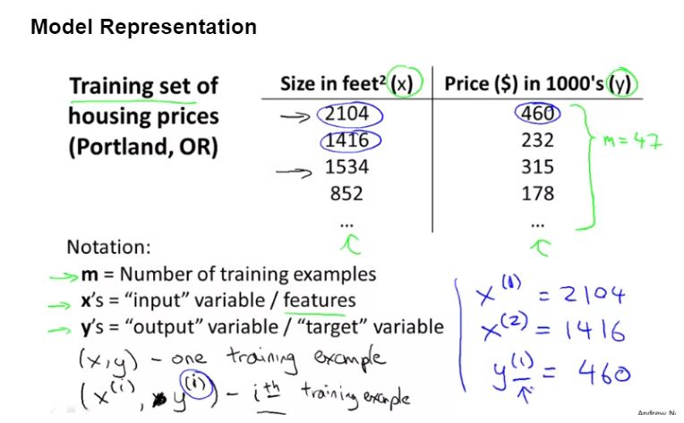
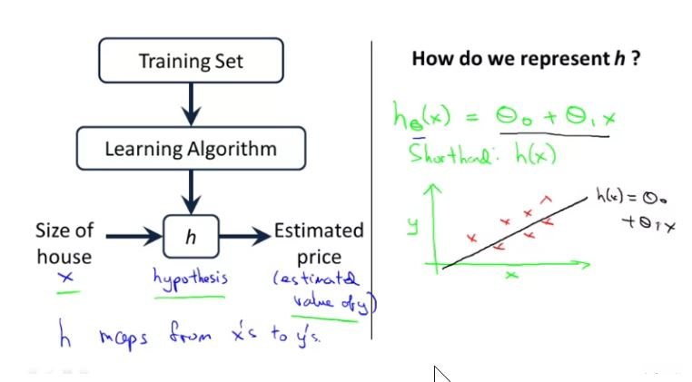
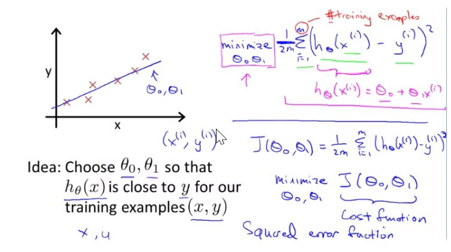
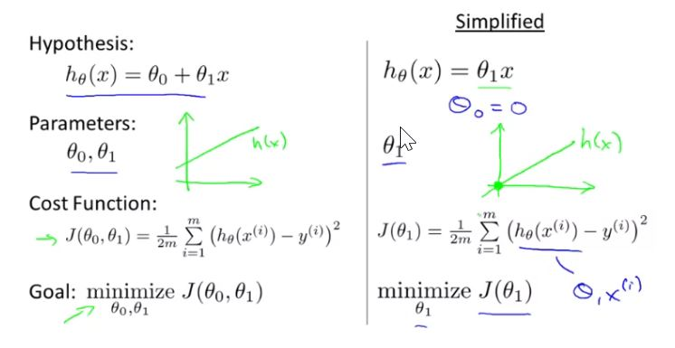
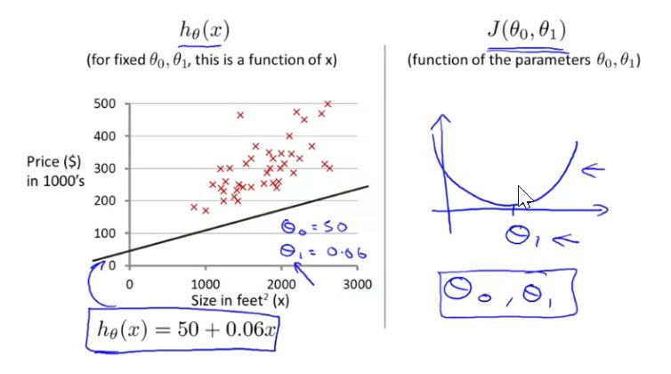
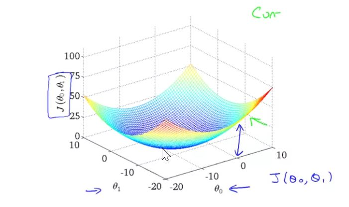

## Model Representation

**Linear regression with one variable - Univariate linear regression**

To describe the supervised learning problem slightly more formally, our goal is, given a training set, to learn a function h : X → Y so that h(x) is a “good” predictor for the corresponding value of y

### Cost Function

Finding parameter values $\theta_0,  \theta_1$ in a way that following cost function is minimized: 

$$ J(\theta_0, \theta_1) = {\frac{1}{2m} \sum_{i=1}^{m}({h(x_i) - y_i})^2} $$

$$ \min_{\theta_0 \theta_1} {J(\theta_0, \theta_1)} $$ 

Note: $\frac{1}{2m}$ is used to simplify the equation. the mean is halved as a convenience for the computation of the gradient descent, as the derivative term of the square function will cancel out the 1/2 term.

Where $ J(\theta_0, \theta_1) $ is called the cost function or squared error function

### Cost Function - Intuition-I

We can find the cost function of the hypothesis by simplifying the hypothesis with $\theta_0 = 0$ In this case, simplified cost function will be $ J(\theta_1)$

The best possible line will be such so that the average squared vertical distances of the scattered points from the line will be least. Ideally, the line should pass through all the points of our training data set. In such case, the value of $J(\theta_0, \theta_1)$ will be 0

In the following case, cost function is minimum when $\theta_1$ is 0

### Cost Function - Intuition II

In the last example, we had assumed that $\theta_0=0$, which had simplified the equation of cost function, however in the practical, cost function will depend on both $ \theta_0 and \theta_1$

Given that cost function depends on both $ \theta_0 and \theta_1$, the graph will be a 3-dimensional plot

The 3-D plot can also be visualized by a contour, in which the value of cost function anywhere in the concentric circle is same.

If we take 800 and -0.15 as $ \theta_0 and \theta_1$, then the corresponding hypothesis is drawn in the left plot which is not a good fit.

testing of texify 

$\frac{1}{2m}$

testing with html rendering using codecogs.com/latex/eqneditor.php

