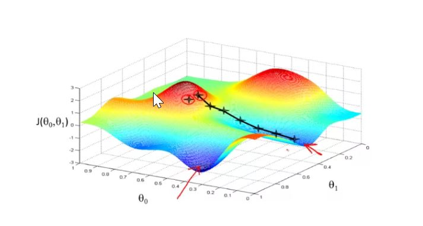
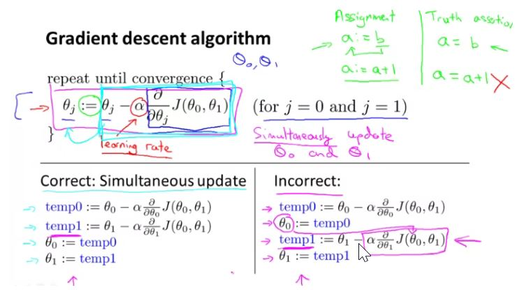
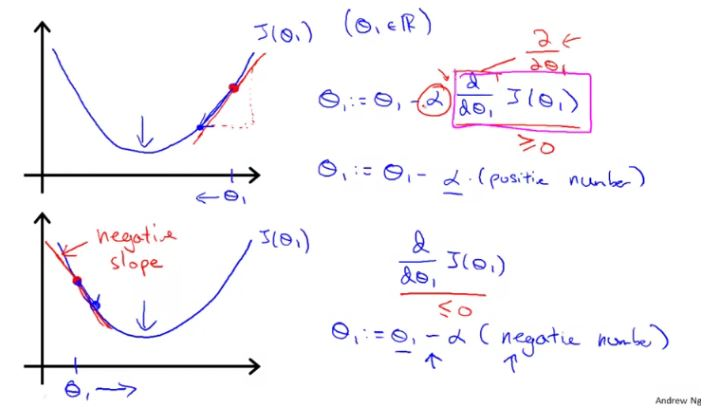
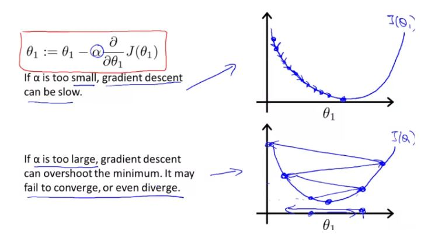
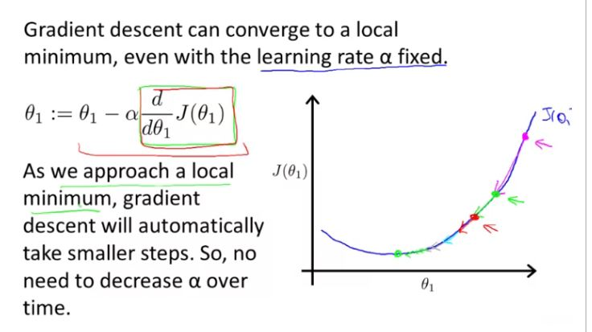
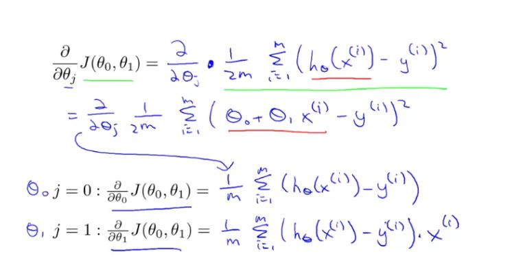
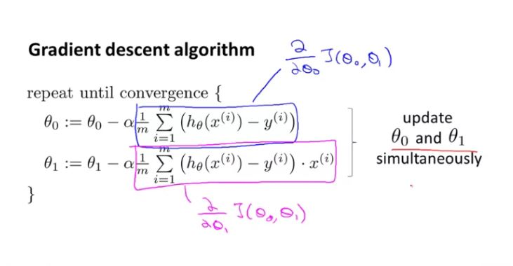
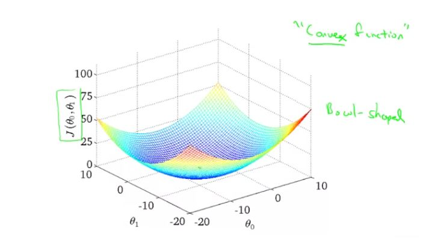
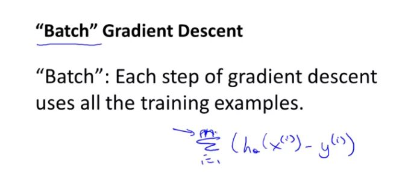

## Gradient Descent

We have our hypothesis function and we have a way of measuring how well it fits into the data. Now we need to estimate the parameters in the hypothesis function. That's where gradient descent comes in. It is used to minimize cost function $J(\theta_0, \theta_1 .... \theta_n)$. it can be used to minimize other functions also.

#### Steps are:
1. Start with some $ {\theta_0} and {\theta_1}$
2. Keep changing $\theta_0, \theta_1$ to reduce cost function until we hopefully end up with minimum

Gradient descent has an interesting property. For different values of $ \theta_0 and { \theta_1}$, it will find different local minima as it finds the steepest downfall from its current position. in the picture below, for 2 fairly near points, it provides different minima.

The way to do this is by taking derivative (the tangential line to a function) of our cost function. The slope of the tangent is the derivative at that point and it will give us a direction to move towards. we make steps down the cost function in the direction with the steepest descent. the size of each step is determined by the parameter $\alpha$, which is called the learning rate. 

for example, the distance between each 'star' in the graph represents a step determined by $\alpha$. smaller $\alpha$ means smaller step and larger $\alpha$ means larger step. the direction is determined by the partial derivative of $ J (\theta_0, \theta_1)$
However total descent traversed will also depend on the slope at the point of current $\theta$. If the slope is greater, descent will be higher and vice versa.

### Gradient Descent Intuition

In the following picture, we can understand the effect of derivative part of the equation, which is dictating the direction to go to.

### Gradient Descent for Linear Regression

Since $ J(\theta_0, \theta_1)$ is a bowl like function, it does not have local minima, so gradient function will always returns to global minima.

