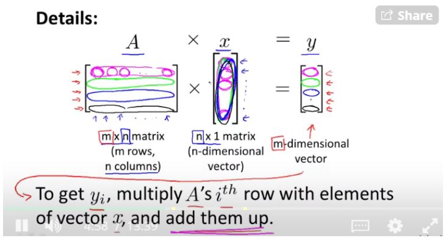
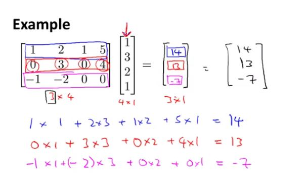
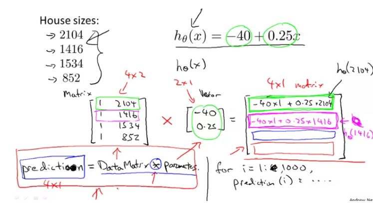
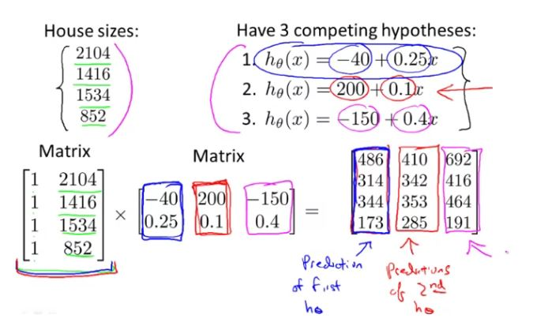
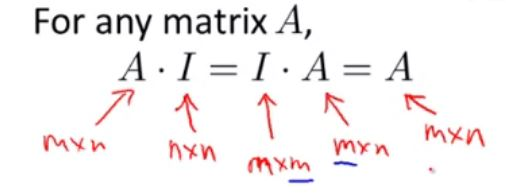
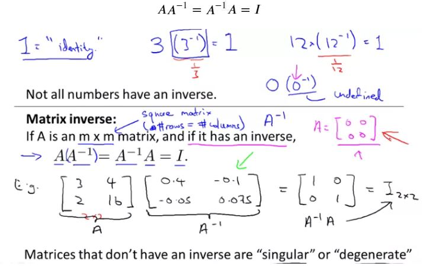
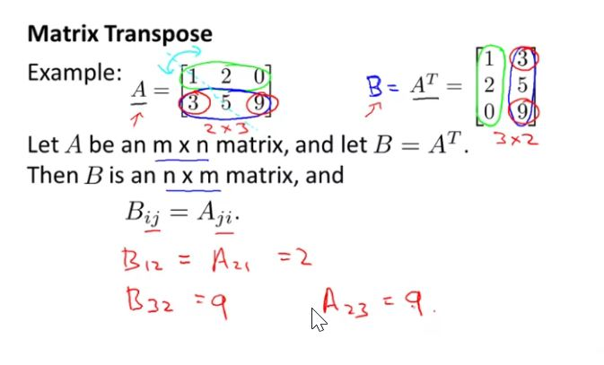

### Matrices & Vectors

$ \mathbb{R}^{4x2}$ means that the matrix is a 4x2 dimension.

A Vector is a matrix with only 1 column i.e. vector is a n x 1 matrix
a 4-row matrix is called as 4 dimensional vector which is denoted by $ \mathbb{R}^{4}$

Unlike matrix, index of vector can start from either 0 and 1. unless otherwise specified, we will use 1-indexed vectors

Uppercase letter is used to refer to Matrix and lowecase is used to refer to vectors.

"Scalar" means that an object is a single value, not a vector or matrix and $\mathbb{R}$ refers to the set of scalar real numbers.

```octave
% The ; denotes we are going back to a new row.
A = [1, 2, 3; 4, 5, 6; 7, 8, 9; 10, 11, 12]

% Initialize a vector 
v = [1;2;3] 

% Get the dimension of the matrix A where m = rows and n = columns
[m,n] = size(A)

% You could also store it this way
dim_A = size(A)

% Get the dimension of the vector v 
dim_v = size(v)

% Now let's index into the 2nd row 3rd column of matrix A
A_23 = A(2,3)
```

### Addition and scalar multiplication

scalar means real number $\mathbb{R}$

```octave
% Initialize matrix A and B 
A = [1, 2, 4; 5, 3, 2]
B = [1, 3, 4; 1, 1, 1]

% Initialize constant s 
s = 2

% See how element-wise addition works
add_AB = A + B 

% See how element-wise subtraction works
sub_AB = A - B

% See how scalar multiplication works
mult_As = A * s

% Divide A by s
div_As = A / s

% What happens if we have a Matrix + scalar?
add_As = A + s

```

### Matrix Vector Multiplication

Unless no of column of first matrix matches with no of rows of second matrix, multiplication cant be done. Multiplication of matrices of dimension 3 x 2 and 2 x 1 will result a matrix of dimension 3 x 1.





#### Trick to find the outcome of X in hypothesis function using vector matrix multiplication



```octave
% Initialize matrix A 
A = [1, 2, 3; 4, 5, 6;7, 8, 9] 

% Initialize vector v 
v = [1; 1; 1] 

% Multiply A * v
Av = A * v

```


#### Application of matrix-matrix multiplication in linear regression

Matrix matrix multiplication is used to compute the $\theta_0, \theta_1$ of the hypothesis function. This method can be used instead of gradient descent method to arrive at the coeffienents and intercept of the hypothesis.


```octave
% Initialize a 3 by 2 matrix 
A = [1, 2; 3, 4;5, 6]

% Initialize a 2 by 1 matrix 
B = [1; 2] 

% We expect a resulting matrix of (3 by 2)*(2 by 1) = (3 by 1) 
mult_AB = A*B
```

### Matrix Multiplication Properties

1. Let A and B be matrices, Then in general,  A X B $\neq$ B X A **(not commutative)**
2. Let A, B and C be matrices, then, A X (B X C) = (A X B) X C **(Assosciative property)**
3. For any matrix A, A X I = I X A = A, where I is an identity matrix. If A is an mxn matrix then the dimension of identitiy matrix will be in following way.

Dimension of identity matrix will be implicit from the content. so these two I's are actually of different dimensions.
We can also say that commutative property hold true if one of the matrix is an identity matrix.

```octave
% Initialize random matrices A and B 
A = [1,2;4,5]
B = [1,1;0,2]

% Initialize a 2 by 2 identity matrix
I = eye(2)

% The above notation is the same as I = [1,0;0,1]

% What happens when we multiply I*A ? 
IA = I*A 

% How about A*I ? 
AI = A*I 

% Compute A*B 
AB = A*B 

% Is it equal to B*A? 
BA = B*A 

% Note that IA = AI but AB != BA
```

### Inverse and Transpose
If A is an mxm matrix and it has an inverse, then
$$ A{A}^{-1} = {A}^{-1}A = I$$





```octave
% Initialize matrix A 
A = [1,2,0;0,5,6;7,0,9]

% Transpose A 
A_trans = A' 

% Take the inverse of A 
A_inv = inv(A)

% What is A^(-1)*A? 
A_invA = inv(A)*A

```