## Learning with Large Datasets

### Gradient Descent with Large Datasets

How can you tell if using larger dataset (say 100 million) is likely to perform much better than using a small subset of data (say 1000)

----

Plot a learning curve for a range of values of m and verify that the algorithm has high variance when m is small.

In the above picture, it is prudent to use large datasets, however in the second case, algorithm will work just as good with lesser datasets.

### Stochastic Gradient Descent

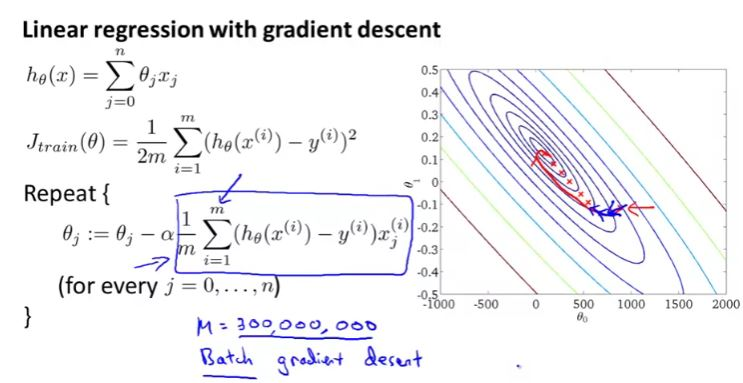

Gradient descent need to read into memory all m (say 300 million) records in order to compute the derivate term for just one step of gradient descent. it is very time consuming. 

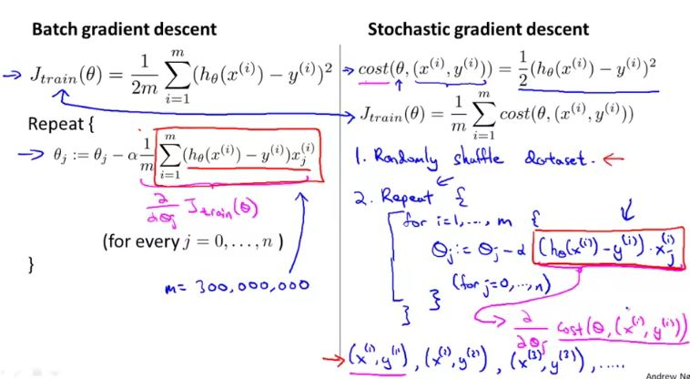
Unlike batch gradient descent, stochastic gradient descent does not converge to a global minima instead it will sort of converge to a smaller region which contains global minima i.e. converge near global minimum. 

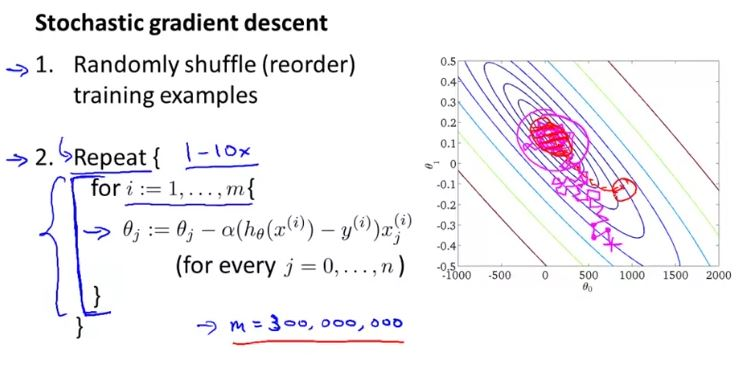

### Mini Batch Gradient Descent

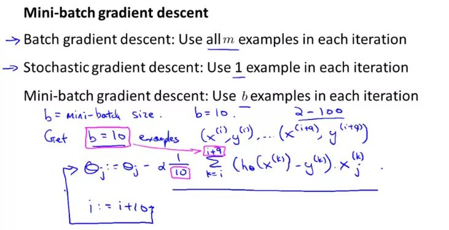

Typical range of mini-batch is 2-100

mini batch gradient descent outperforms stochastic gradient descent when you vectorize the summation part of the gradient descent.

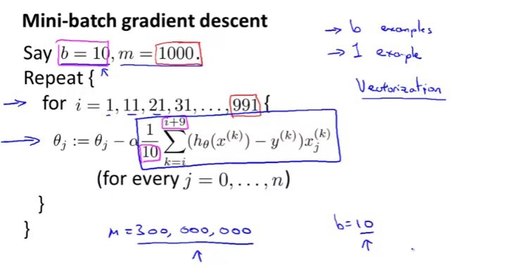

### Stochastic Gradient Descent Convergence

 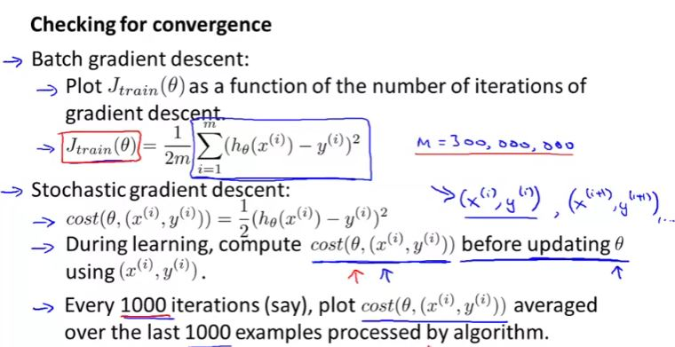

- In the first picture, it shows that using smaller value of $\alpha$, cost function may converge better around global minima. 
- In the second graph, it shows that using larger number on which cost function is averaged, will result in a smoother graph

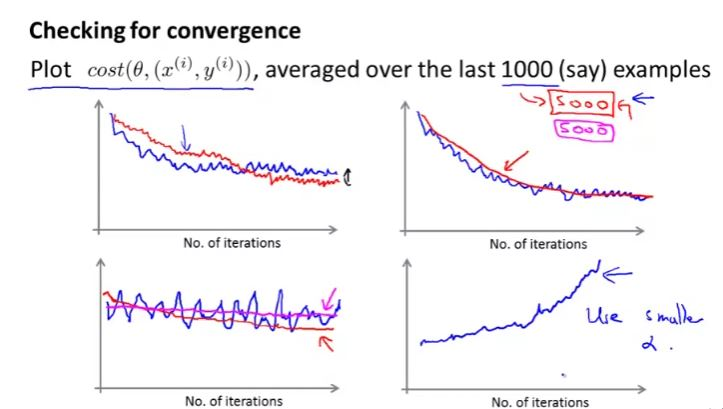

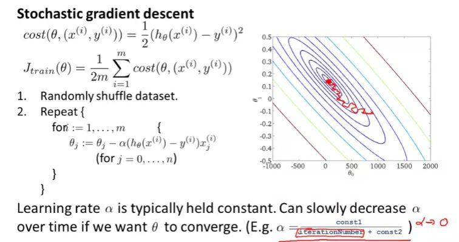

### Online Learning

 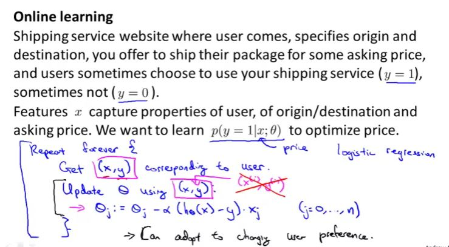

CTR - click through rate - probability that an user will click a returned list from a search queries.

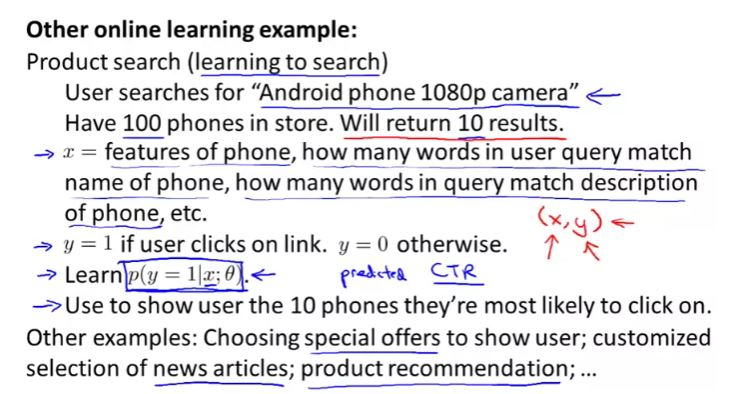

### Map Reduce and Data Parallelism

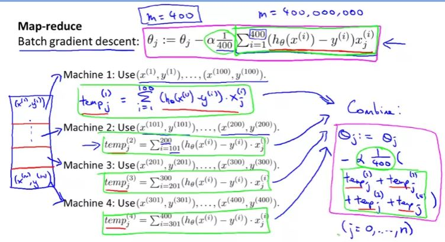

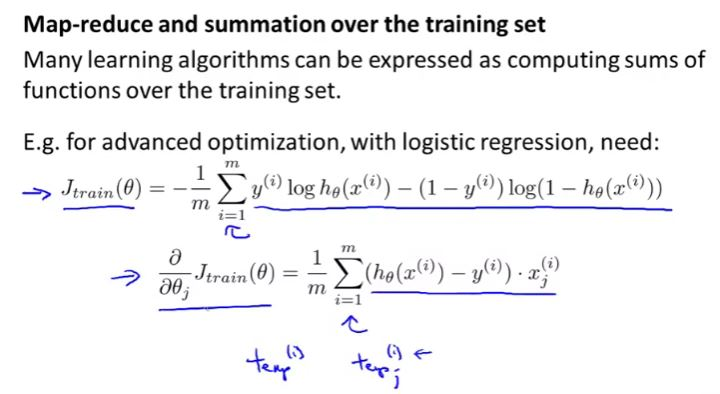

Instead of different machine, one can also use multiple core of same machine which is better as it does not have any network latency.