### Problem Description and Pipeline

Photo OCR - Photo Optical Character Recognition

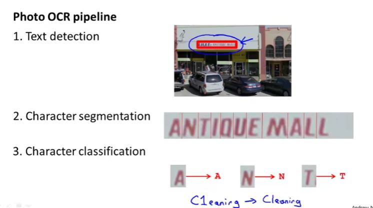

### Sliding Windows

pedestrian detection is slightly easier than text detection as aspect ration for pedestrian detection is same.

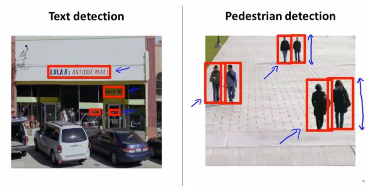

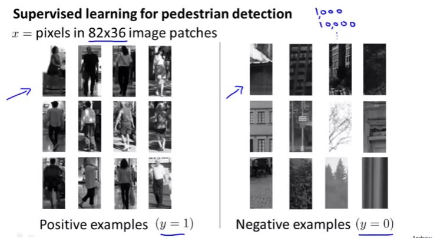

To find the pedestrian, green window will slide by step size or stride (say 4-5 pixels)

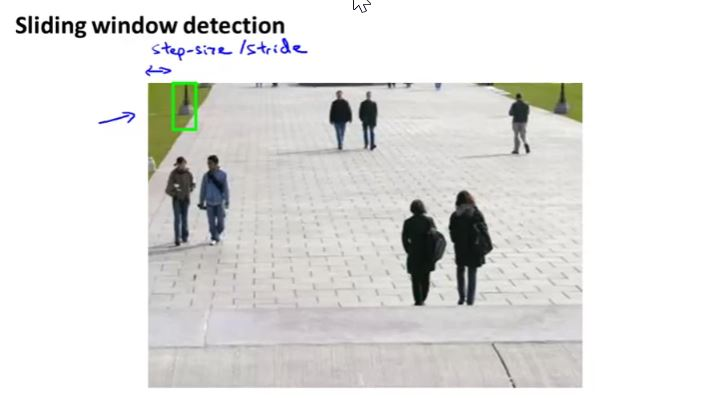

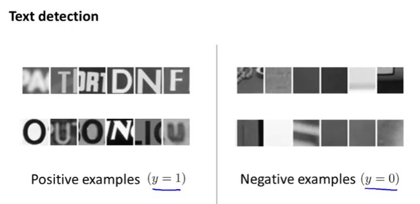

In case of text detection, we first find the text in the photograph using a supervised learning method and then use expansion to find the text blocks. 

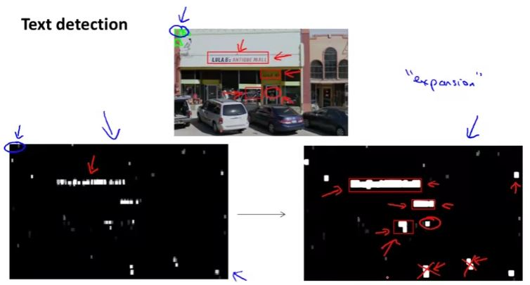

In this case when we find a gap in between two letter, we do letter segmentation and slide the window to find the next gap.

### Getting lots of Data and Artificial Data

In the following case, you may generate  synthetic data using the computer fonts and then using those letter to create similar styled dataset using blurring and other effect such as artificial warping. 

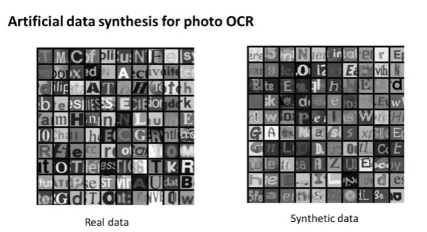

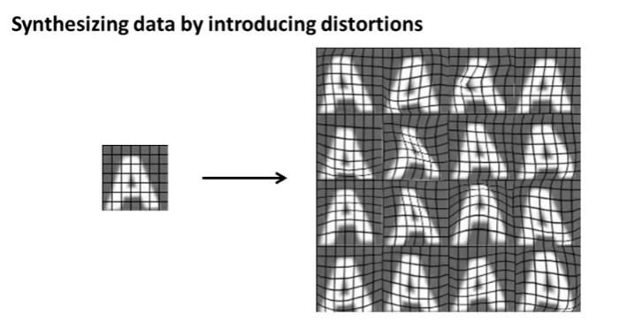

You can also synthesize new audio data by adding noisy background such as crowd and machinery.

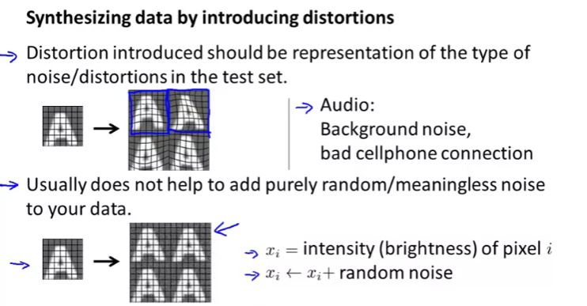

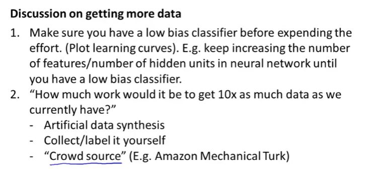

### Ceiling Analysis

To identify which part of the pipeline required more effort, we can do ceiling analysis. lets say we have an overall accuracy of 72% for the system. Now if we manually classify the text and have 100% accurate text detection then overall accuracy increases to 89%. in similar way perfect character segmentation and Character recognition results in 90% and 100% overall accuracy. 

So we can say that text detection and character recognition required more your efforts.

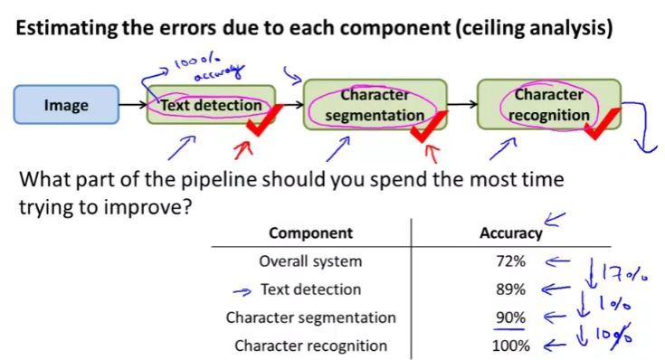

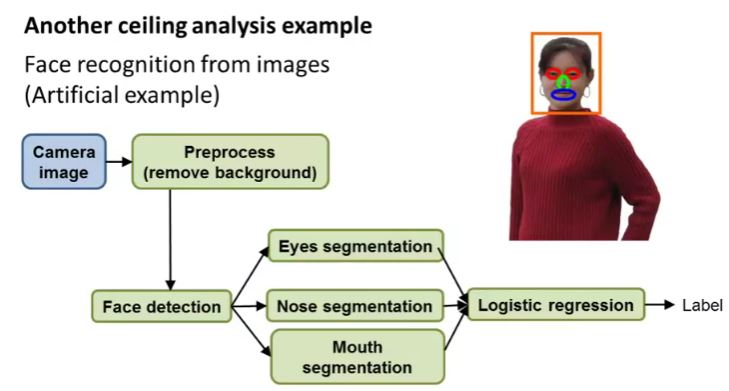

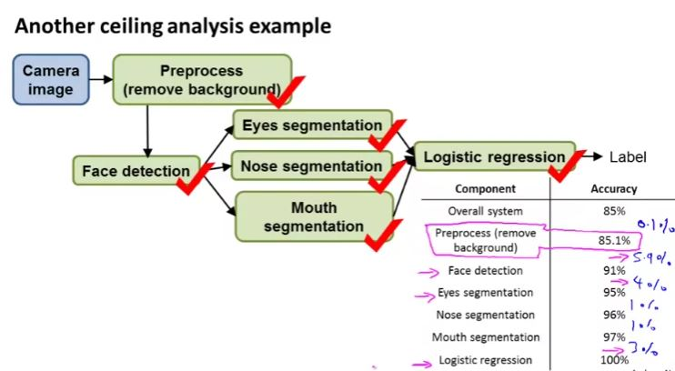

