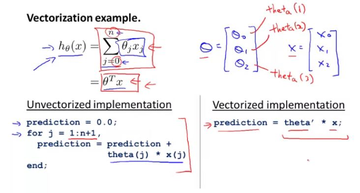
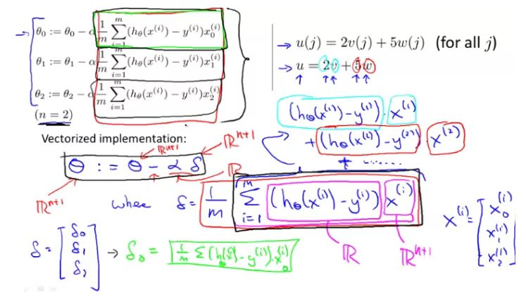

### Basic Operation

Changing the prompt of octave
`PS1('>> ')`

Difference between normal random variable and Guassian random variable
```octave
5 + 3    # 8
9-2      # 7
5*3      # 15
4/1      # 4
1==2     # 0
1==1     # 1
1~=1     # 0
1&&0     # 0
1||1     # 1
xor(1,0) # 1
a=pi;    # a = 3.1416
disp(a)  # 3.1416

# print out 2 decimals: 3.14
disp(sprintf('2 decimals: %0.2f', a))

# Creating a 3 x 2 matrix
A = [1 2; 3 4; 5 6]
 
# Creating a matrix of row 1 with value starting from 1 to 7 with increment of 0.1
v = 1:0.1:7

v = 1:5    # 1 2 3 4 5
ones(2,3)  # return 2,3 matrix with value 1
c = 3*ones(2,3)
zeros(1,3) # return 1,3 matrix with value 0
w = rand(1,3)     # Using normal random variable
w = randn(1,3)    # Using guassian random variable

# This will create a 1 x 10000 matrix with mean of -6 and standard deviation of sqrt(10)
w = -6 +sqrt(10)*(randn(1,10000));

# plotting histogram 
hist(w)
hist(w, 50)     # 50 bins
eye(4)          # identitiy matrix with 4 rows and 4 columns
```

### Moving Data Around
```octave
A = [1 2; 3 4; 5 6]
size(A)      # returns 3 2 (1 x 2 matrix)
size(A,1)    # returns 3
length(A)    # returns the size of longest dimension; 3

# file navigation
cd 'C:\Users\panka\Desktop'    # changing to Desktop folder
pwd                            # Display current folder
ls                             # List all files and folder

# Loading data
load featuresX.dat       # Loading featureX.dat file
load priceY.dat

who               # variables in current scope
featuresX         # Display featureX data   
size(featureX)    # Size of the dataset
whos              # variable with their size and type of data

clear featuresX   # clearing the dataset
v = priceY(1:10)  # v will be first 10 element of the priceY
save hello.mat v; # will save v in a file named as hello.mat, save in binary format
clear             # delete all variables in the workspace
save hello.txt v -ascii     # save as text

A(3,2)       # Data at row 3 & column 2
A(2,:)       # : means element along that row/column
A(:,2)       # all data of column 2
A([1 3], :)  # all elements of row 1 and 3
A(:,2) = [10;11;12]        # assign value to the second column
A = [A, [100; 101; 102]];  # append another column vector to right
A(:)                       # put all element of A into a single vector
B = [11 12; 13 14; 15 16]
C = [A B]          # Adding B to A column wise, comma will also work A, B
C = [A; B]         # Adding B to A row wise, semicolon means that go to the next line
```

### computing on Data
```octave
A = [1 2; 3 4; 5 6]
B = [11 12; 13 14; 15 16]
C = [1 1; 2 2]
A*C        # multiply matrix
A.* B      # multiply element wise multiplication
A .^ 2     # element wise squaring
v = [1; 2; 3]
1 ./ v     # dividing 1 with v's elements
log(v)     # element wise logarithm
exp(v)
abs(v)
-v         # returns -1 .* v
v + ones(length(v),1)    # increasing value of elements by 1
v + 1                    # same result as previous
A'                       # transpose of A
(A')'
a = [1 15 2 0.5]
val = max(a)        # returns 15
[val, ind] = max(a) # both value and index
a < 4               # returns 1 0 1 1
A = magic(3)        # create a 3x3 matrix where all rows and columns equal to same value
[r, c] = find(A >= 7)     # returns r & c vector which satisfy the condition
sum(a)      # sum of all element 
prod(a)     # product
floor(a)    
ceil(a)

rand(3)     # generating 3x3 matrix with random number
max(rand(3), rand(3))       # maximum of two randum 3x3 matrix
max(A, [], 1)       # getting max element from each column
max(A, [], 2)       # getting max element from each row
A(:)                # convert the matrix in a vectorized format


sum(A, 1)      # sum all element of columns
sum(A, 2)      # sum all element of rows

# getting sum of diagonal element
sum(sum(A .* eye(3)))

# getting sum of other diagonal elements
sum(sum(A .* flipud(eye(9))))

# inverse of A
pinv(A)
```

### Plotting Data
```octave
t = [0:0.01:0.98]
y1 = sin(2*t*pi*4)
y2 = cos(2*t*pi*4)
plot(t, y1)
hold on;           # hold the previous plot
plot(t,y2,'r')     # 'r' denotes different color for the plot red
xlabel('time')
xlabel('value')
legend('sin', 'cos')
title('my plot')

# saving the file in a different directory
cd 'C:\Users\panka\Desktop' ; print -dpng 'myPlot.png'

close     # figure closes

# Using multiple figures to plot multiple plots
figure(1); plot(t, y1)
xlabel('time')
figure(2); plot(t, y2)
ylable('value')

# Using subplot to plot multiple graph in the same window
subplot(1,2,1);    # divides plot in a 1x2 grid, access first element
plot(t,y1);
subplot(1,2,2);
plot(t,y2)

# changing the axis scale
axis([0.5 1 -1 1])     # first 2 elements are for x axis and last 2 element is for y axis
# visualizing a matrix using plot
imagesc(A);

images(A), colorbar, colormap gray;

# comma chaining a command or function calls
a=1, b=2, c=3
a=1, b=2, c=3
a=1, b=2, c=3
a=1, b=2, c=3

​```
```

### Control statements
```octave

# for loop
for i=1:10,
    v(i) = 2 ^ i;
end;

# while loop
i = 1;
while i <= 5,
    v(i) = 100;
    i = i+1;
end;

# break statement
i = 1;
while true,
    v(i) = 999;
    i = i+1;
    if i == 6,
        break;
    end;
end;

# if-else statement
if v(1) == 1,
    disp('The value is 1')
elseif v(1) == 2,
    disp('The value is 2')
else
    disp('The value is neither 1 nor 2')
end;
 

# Function in octave
# create a .m file and write the function in it
function y = squareThisNumber(x)
y = x ^ 2;

# Add to Octave search path so that function will work even if you are in some other directory
addpath('C:\Users\panka\octave')

# returning multiple values from a function
function [y1, y2] = squareAndCubeThisNumber(x)

y1 = x^2;
y2 = x^3;

[r, d] = squareAndCubeThisNumber(6)     # return 36 and 216

# Cost Function J
function J = costFunctionJ(x, y, theta)

# x is the 'design matrix' containing our training examples
# y is the class labels

m = size(x,1); 			# number of training examples; returns 3
predictions = x*theta;   	# predictions of hypothesis on all m examples
sqrErrors = (predictions-y) .^ 2;		# squared errors

J = 1/(2*m) * sum(sqrErrors);

```

### Vectorization





