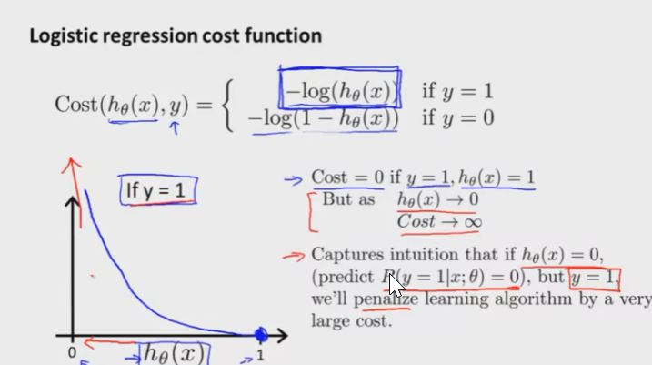
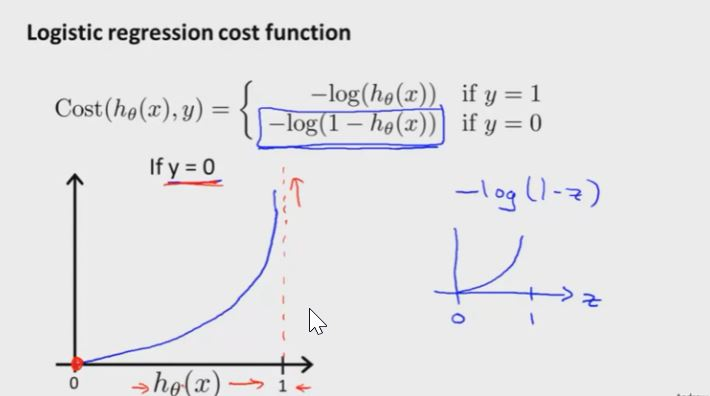
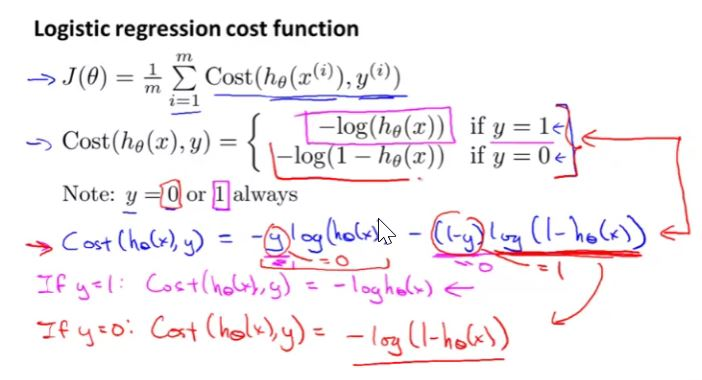
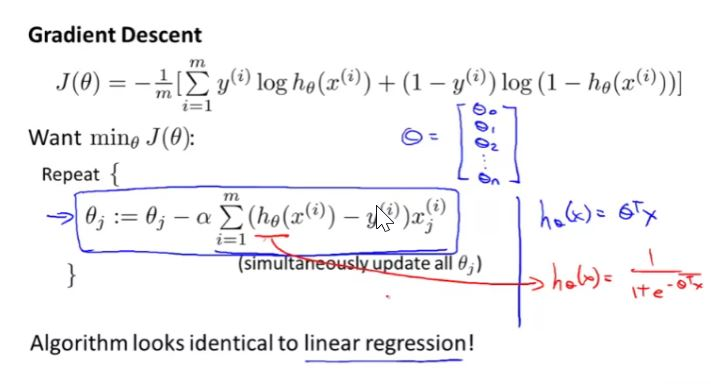
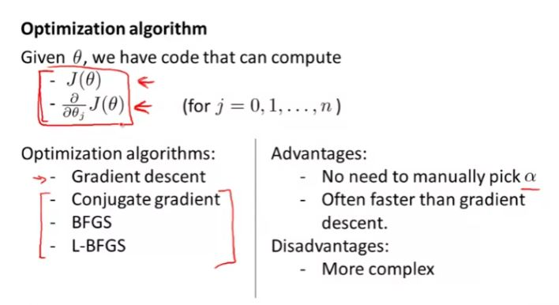
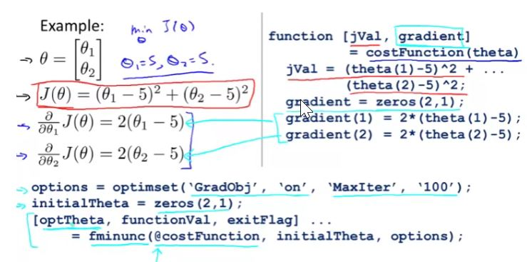
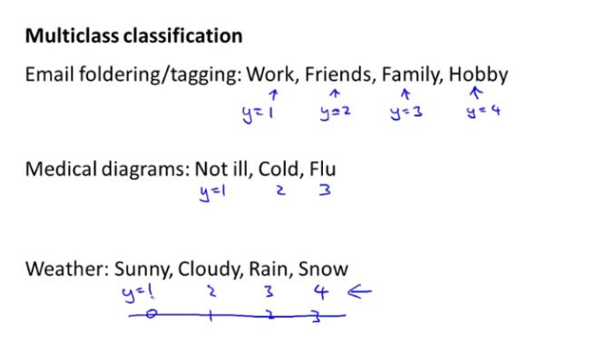
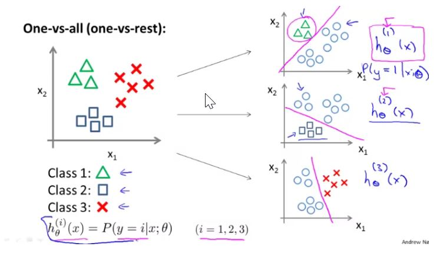
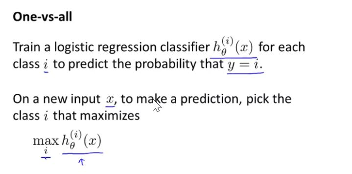

## Cost Function

Cost function that we used in linear regression:

$ J(\theta) = \frac{1}{2m} \sum_{i=1}^{m}{(h_\theta(x^{i})-y^{i})^{2}} $

where, $ Cost(h_\theta(x^{(i)}), y^{(i)}) = \frac{1}{2}{(h_\theta(x^{i})-y^{i})^{2}}$

However this cost function will not work in logistics regression as it will result in a non-convex function which may not optimally converge to a global minima.





### Simplified Cost Function and Gradient Descent



Final cost function is:

$ Cost(h_\theta(x), y) = -y\log(h_\theta(x)) - (1-y)\log(1-
h_\theta(x)) $

**$ J(\theta) = -\frac{1}{m}\sum_{i=1}^{m}y^{(i)}\log(h_\theta(x^{(i)})) + (1-y^{(i)})\log(1-
h_\theta(x^{(i)})) $**

Here $ h_\theta(x) = \frac{1}{1 + \exp^{-\Theta^{T}X}} $



### Vectorized implementation of the algorithm will be
Notice that this algorithm is identical to the one we used in linear regression.


$ h = g(X\theta) $

**$ J(\theta) = \frac{1}{m}(-y^{T}\log(h) - (1-y)^{T}\log(1-h)) $ **

$ \theta_j := \theta_j - \alpha\frac{\delta}{\delta\theta_j}J(\theta) $

$  \theta := \theta - \alpha\frac{1}{m}\sum_{i=1}^{m}[h_\theta(x)^{(i)} - y^{(i)}). x^{(i)}] $

Vectorized implementation is:

$ \theta := \theta - \frac{\alpha}{m}X^{T}g(X\theta) - \overrightarrow{y} $

**Vectorized implementation of gradient is:**

$ \frac{\delta}{\delta\theta_j}J(\theta) = \frac{1}{m} \times (X ^ {T} \times (g(\Theta X) - y)$

### Advanced Optimization



First we need to provide a function that evaluates the following two functions for a given input value

$$ J(\theta) $$

$$ \frac{\delta}{\delta\theta_j}J(\theta) $$

```octave
function [jVal, gradient] = costFunction(theta)
    jVal = [...code to compute J(theta)...]
    gradient = [...code to compute derivate of J(theta)...]
end

% optimset function creates an object containing the options we want to send to fminunc().

options = optimset('GradObj', 'on', 'MaxIter', 100);
initialTheta = zeros(2,1);
    [optTheta, functionVal, exitFlag] = fminunc(@costFunction, initialTheta, options);
```



### Multiclass classification problem

When we have more than two categories. instead of y = {0, 1} we will expand our definition so that y = {0, 1, ... n}







Out of all classifiers, one which has the highest probability of being true is selected.