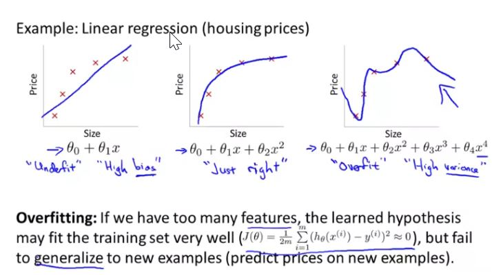
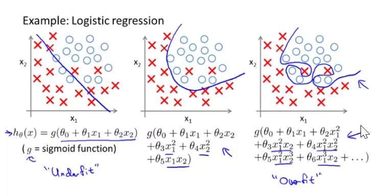
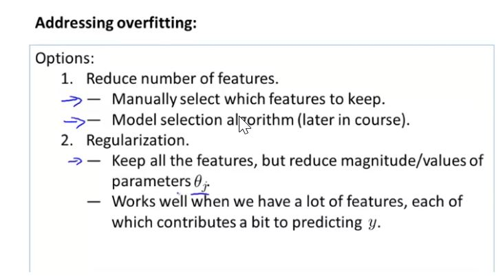
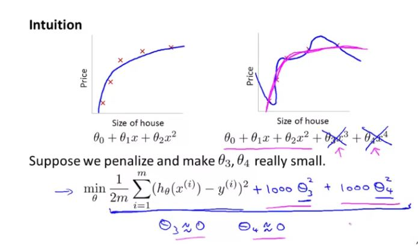
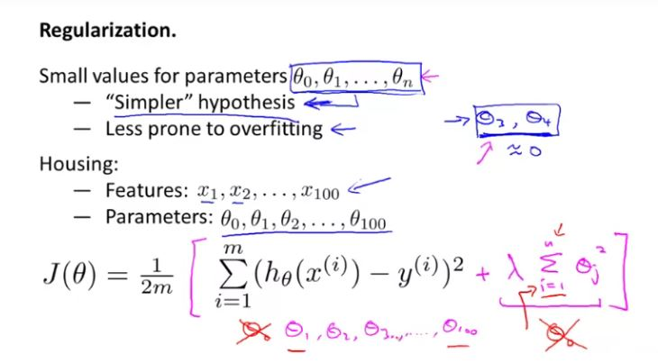
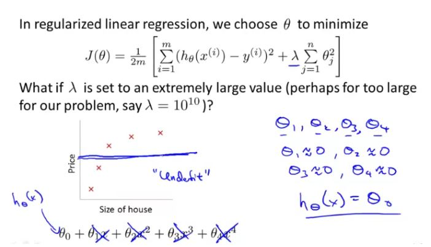
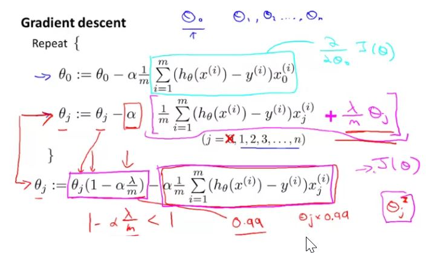
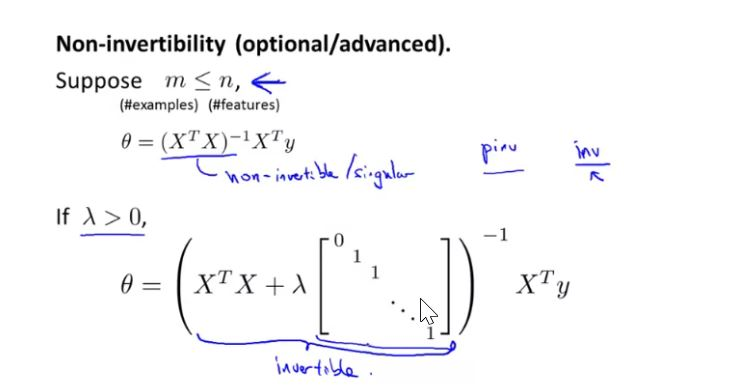
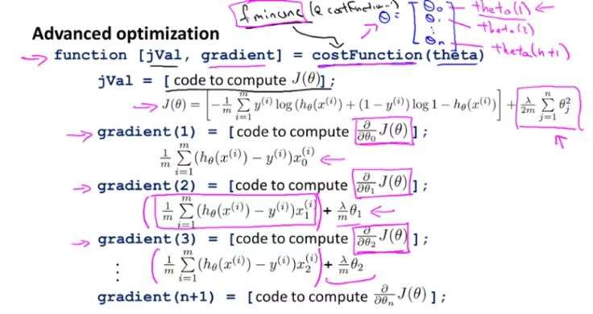
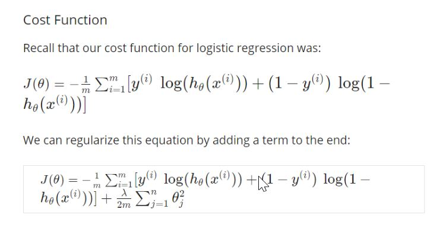

## The Problem of Overfitting

 - Overfitting - if we fit very high order polynomial, then the hypothesis can fit. it's almost as if it can fit any function and this face of possible hypothesis is just too large, its too variable and we don't have enough data to constrain it to give us a good hypothesis so that's called overfitting.
 - Underfitting - or high bias, is when the form of our hypothesis function h maps poorly to the trend of the data. its caused by a function that is too simple or uses too few features.

When we have lots of feature but very less training data, then overfitting can be a problem.

### Cost Function

When we get the value of $\theta$ matrix, we have no clue which one corresponds to higher degree polynomials, so it seems intuitive that we use smaller values for all $\theta$ values.

lambda controls a trade-off between two different goals. the first goal is that we would like to fit the training data well and the second goal is that we want to keep the parameters small.

If the lambda is set to very high number, then it will penalize very heavily for the high value of thetas and result in  all the theta values equal to zero leaving only $\theta_0$, as it is not included in the cost function i.e. we don't penalize $\theta_0$

### Normal Equation

Regularization also resolve the non-invertiblity issue that occurs when no of training data is less than no of features.
Note: m < n

$ \theta = (X^{T}X + \lambda.L)^{-1} X^{T}y $
where L = is the matrix shown in the figure

L has the dimension of (n+1)x(n+1). 

if n = 2, then L will be: 

$\begin{bmatrix}
0 & 0 & 0\\
0 & 1 & 0\\
0 & 0 & 1
\end{bmatrix}$

### Regularized Logistics Regression

