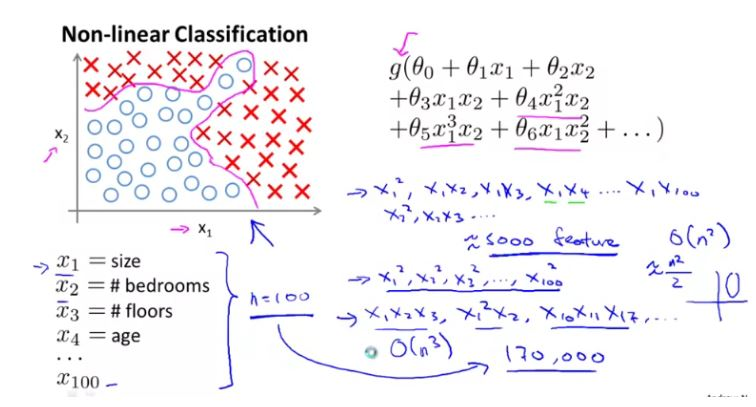
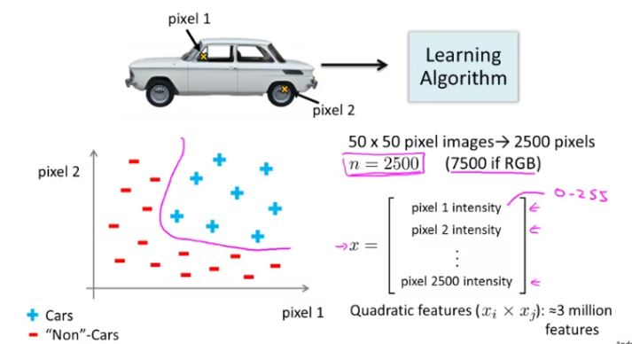
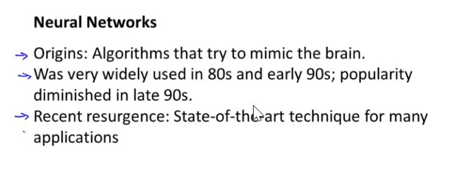
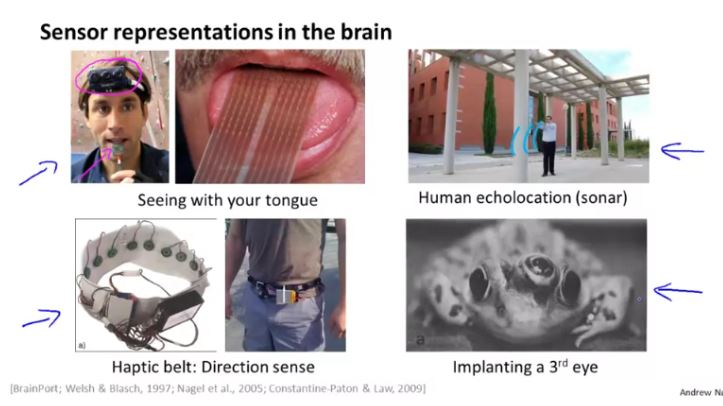

### Non-Linear Hypothesis

Suppose you are learning to recognize cars from 100x100 pixel grayscale images. Let the features be pixel intensity values .If you train logistics regression including all the quadratic terms ($ x_i, x_j $) as features, about how many features will you have? Answer is: 50 million

### Neural Network

Brain uses:

- Auditory Cortex to hear
- Somatosensory Cortes to feel touch

However this different areas of brain can be trained to see and do other functions.

