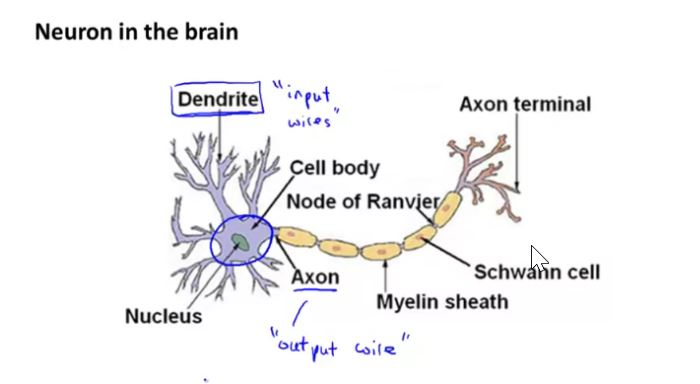
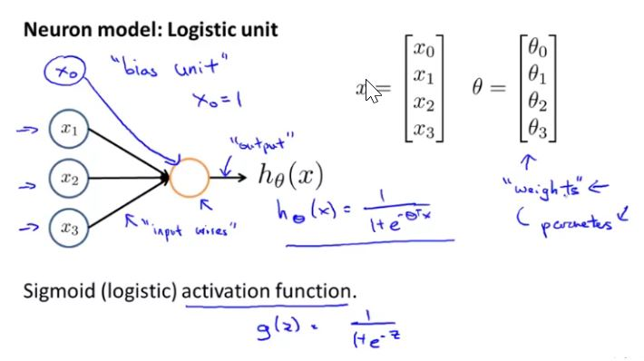
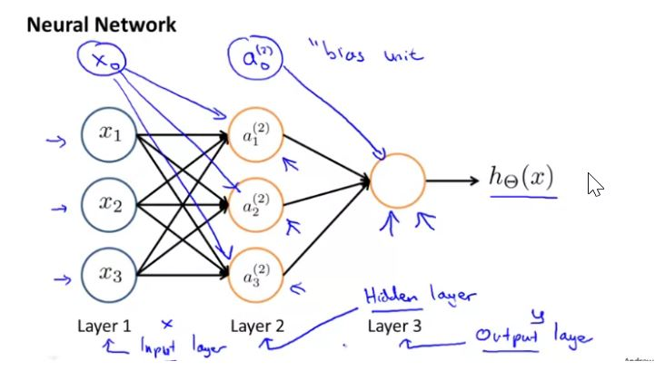
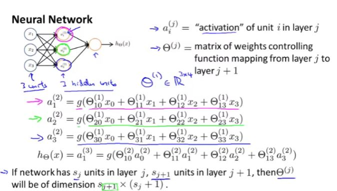
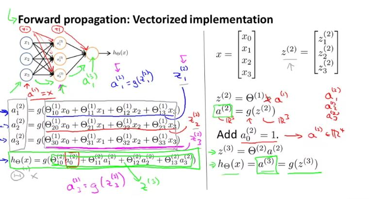

### Model Representation I

At a very simple level, neurons are basically computational units that take inputs (dendrites) as electrical inputs (called "spikes") that are channeled to outputs (axons).

round shape is a neuron in this case, where input is incoming and we get an output.

Our input nodes (layer 1), also known as the input layer go into another node (layer 2), which finally outputs the hypothesis function, known as the "output layer"

 

Here $ \Theta^1$ is (note that 0th row of $\Theta$ is not included as bias unit is always one):

$
\begin{bmatrix}
\Theta_{10}^{1} & \Theta_{11}^{1} & \Theta_{12}^{1} & \Theta_{13}^{1} \\
\Theta_{20}^{1} & \Theta_{21}^{1} & \Theta_{22}^{1} & \Theta_{23}^{1} \\
\Theta_{30}^{1} & \Theta_{31}^{1} & \Theta_{32}^{1} & \Theta_{33}^{1}
\end{bmatrix}
$

and X is:

$ 
\begin{bmatrix}
x_0 \\
x_1 \\
x_2 \\
x_3
\end{bmatrix}
$

and $ a^{(2)}$ = $ g(\Theta^{(1)} \times X) $, where g is a sigmoid or activation function

Similarly $ \Theta^{2}$ is:

$
\begin{bmatrix}
\Theta_{10}^{2} & \Theta_{11}^{2} & \Theta_{12}^{2} & \Theta_{13}^{2}
\end{bmatrix}
$

so we get $ h_\Theta(x) = a_1^{(3)} = g(\Theta^2 \times a^{(3)})$

### Model Representation II

### Vectorized implementation
$ z_k ^{(j)} $ is a new variable that encompasses the parameters inside our g function.

$ a_1 ^{(2)} = g(z_1 ^ {(2)}) $

$ a_2 ^{(2)} = g(z_2 ^ {(2)}) $

$ a_3 ^{(2)} = g(z_3 ^ {(2)}) $

In other words, for layer j=2 and node k, the variable z will be:

$ z_k ^{(2)} = \Theta_{k,0} ^ {(1)}x_0 + \Theta_{k,1} ^ {(1)}x_1 + \cdots + \Theta_{k,n} ^ {(1)}x_n $

Setting x = $a ^{(j-1)}$, we can rewrite the equation as:

$ z ^ {(j)} = \Theta ^ {(j-1)} a ^ {(j-1)} $

We are multiplying our matrix $\Theta^{(j-1)}$ with dimensions $ S_j \times(n+1) $ (where $ S_j$ is the number of our activation nodes) by our vector $a^{(j-1)}$ with height (n+1). This gives us our vector $z^{(j)}$ with height $S_j$. Now we can get a vector of our activation nodes for layer j as follow:

$ a^{(j)} = g(z^{(j)}) $

Neural network is a type of logistics regression in which instead of feeding input values, we are sending new feature "a" derived from input values. In the last step, we are doing exactly the same thing as we did in logistics regression. Adding all these intermediate layers in neural networks allows us to more elegantly produce interesting and more complex non-linear hypothesis.