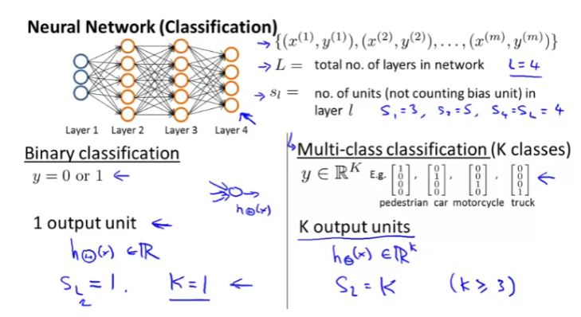
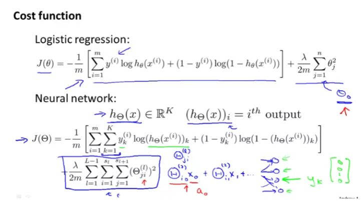
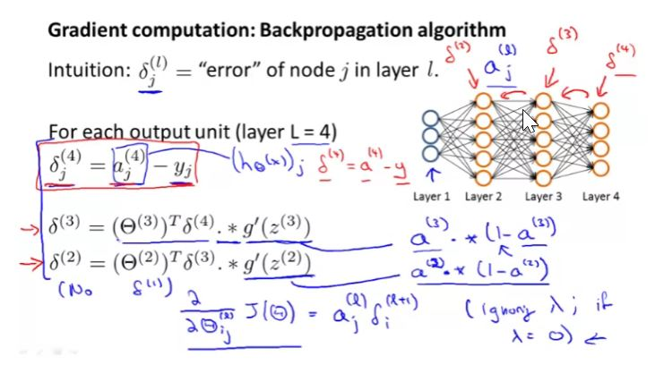
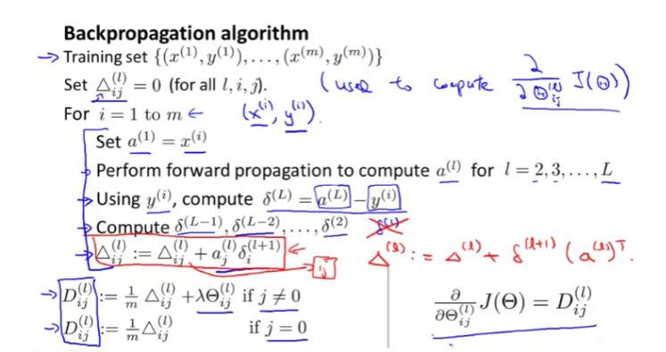
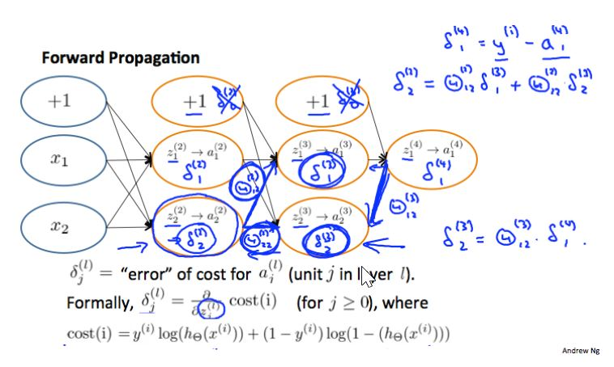

## Neural Network (Classification)

The second part here sums up all the values of all theta matrices. For 4 layers, there will be 3 theta matrices namely $ \Theta^1, \Theta^2, \Theta^3$. 

- The last 2 summation will sum up the each elements of the matrix of layer l. for example for l = 2, it will calculate

  $ \sum_{i=1}^{s_l}{\sum_{j=1}^{s_j+1}{(\Theta_{ji}^{(l)})^2}} $

  $ \sum_{i=1}^{5}{\sum_{j=1}^{6}{(\Theta_{ji}^{(2)})^2}} $

  It will calculate each element of matrix $ \Theta^2 $ from row 1 as given below:

  $
  \begin{bmatrix}
  \Theta_{11} & \Theta_{21} & \Theta_{31} & \Theta_{41} & \Theta_{51} & \Theta_{61}\\
  \Theta_{12} & \Theta_{22} & \Theta_{32} & \Theta_{42} & \Theta_{52} & \Theta_{62}\\
  \Theta_{13} & \Theta_{22} & \Theta_{33} & \Theta_{43} & \Theta_{53} & \Theta_{63}\\
  \Theta_{14} & \Theta_{23} & \Theta_{34} & \Theta_{44} & \Theta_{54} & \Theta_{64}\\
  \Theta_{15} & \Theta_{25} & \Theta_{35} & \Theta_{45} & \Theta_{55} & \Theta_{65}\\
  \end{bmatrix}
  $

  

- Given the summation of each elements of all matrices, first summation will sum up and provide the final values of sum of all element of all theta matrices.

### Backpropagation Algorithm

Backpropagation is neural network terminology for minimizing our cost function like gradient descent in logistics and linear function

Note: there is no $ \delta ^ {1} $ as we don't associate input terms with error.

$ \delta ^ {4} $ are simply the differences of our actual results in the last layer and the correct outputs in the y.

$ \delta ^{(l)} = (\Theta ^ {(l)})^ {T} \delta ^ {(l+1)} .* a^{(l)} .\times (1-a^{(l)}) $

$ \delta ^{(3)} = (\Theta ^ {(3)})^ {T} \delta ^ {(4)} .* a^{(3)} .\times (1-a^{(3)}) $

Here $g ^ {'}$ (g-prime) is the derivative of the activation function g evaluated with the input values given by $ z ^ {(l)} $

The capital-delta matrix D is used as an "accumulator" to add up our values as we go along and eventually compute our partial derivative.

If we consider simple non-multiclass classification (k=1) and disregard regularization, the cost is computed with:

$ cost(t) = y^{(t)}log(h_\Theta{(x^{(t)})}) + (1-y^{(t)})log(1-h_\Theta{(x^{(t)})}) $

Intuitively, $ \delta^{(l)}$ is the "error" for $ a_j^{(l)}$ (unit j in layer l). More formally, the delta values are actually the derivative of the cost function.

$\delta_j^{(l)} = \frac{\partial}{\partial {z_j^{(l)}}} cost(t)$

Recall  that our derivative is the slope of a line tangent to the cost function, so the steeper the slope the more incorrect we are. Let us consider the following network below and see how we could calculate some $\delta_j^{(l)}$

**Note: weight of the path from $a_i^2$ to $a_j^3$ will be $\Theta_{ji}^{2}$ . For example weight of path from $a_2^2$ to $a_1^3$ will be $\Theta_{12}^{2}$.**

In the image above, to calculate $\delta_2^{(2)}$, we multiply the weights $\Theta_{12}^{(2)}$ and $\Theta_{22}^{(2)}$  by their respective $\delta$ values found to the right of each edge. So we get .$ \delta_2 ^ {2} = \Theta_{12} ^ {2}*\delta_1 ^ {3} + \Theta_{22} ^ {2}*\delta_2 ^ {3}$  

