## Backpropagation in Practice

### Unrolling parameters
optimization algorithm in octave assumes that initial theta and gradient are vectors of size n+1

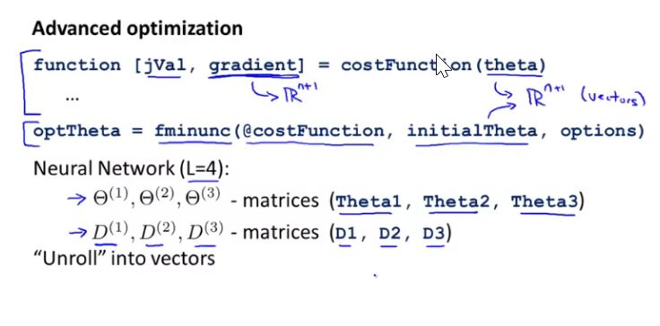

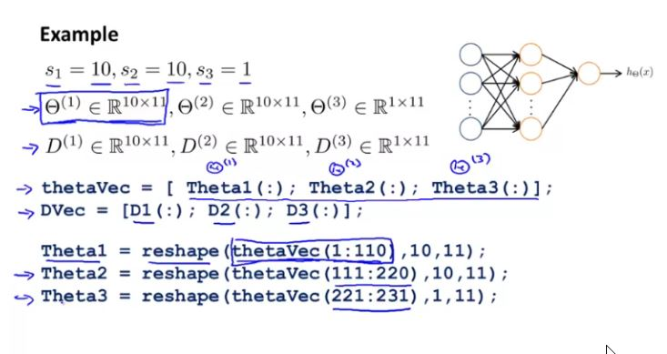

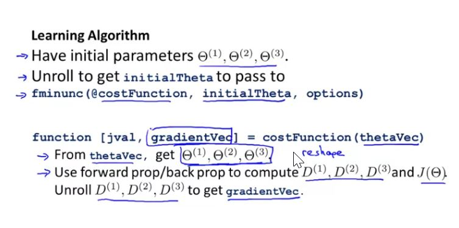

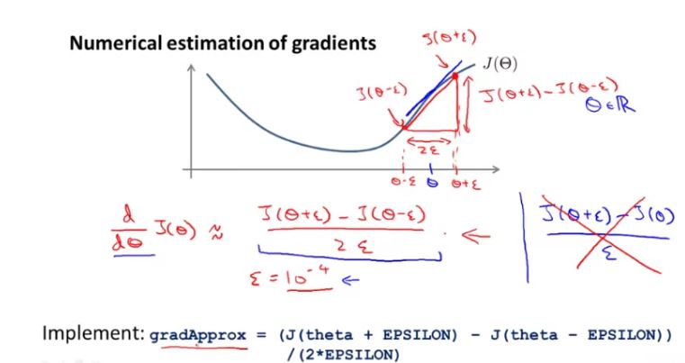

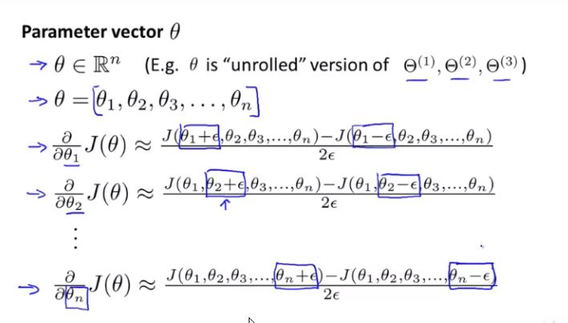

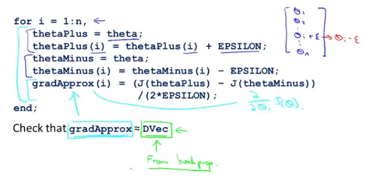

Here 	epsilon = 1e-4;

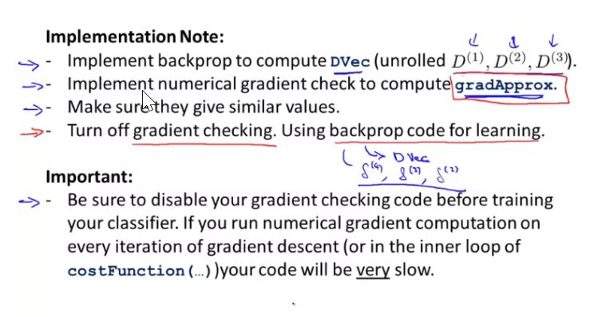

### Random Initialization

Initializing all theta weights to zero does not work with neural networks because after backpropagation, all nodes will update to the same value repeatedly.

rand(x, y) is just a function in octave that will initialize a matrix of random real numbers between 0 and 1.

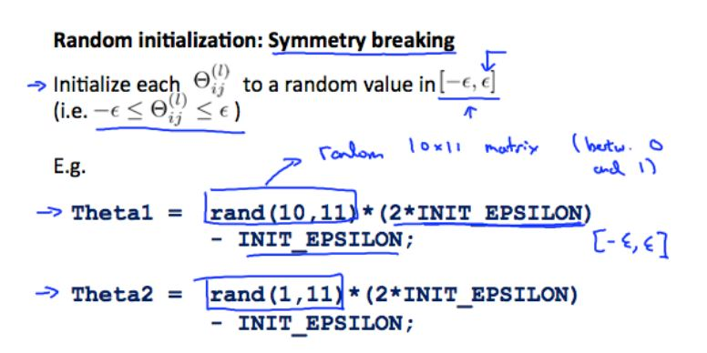

### Putting it together

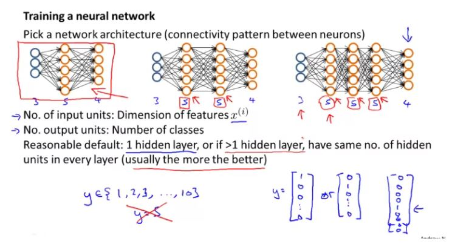

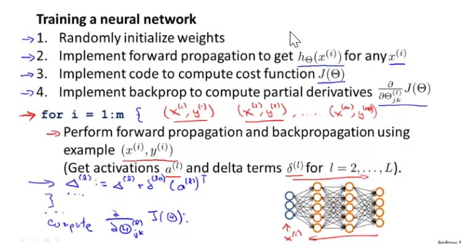

Since $J(\Theta)$ is non-convex here, gradient descent or advanced optimization may result in local minima instead of global minima

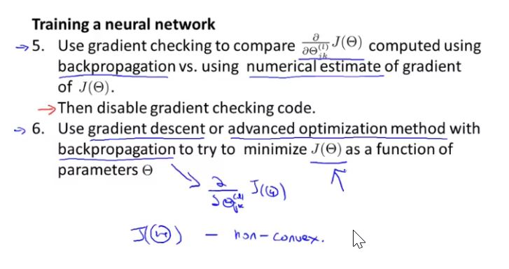

