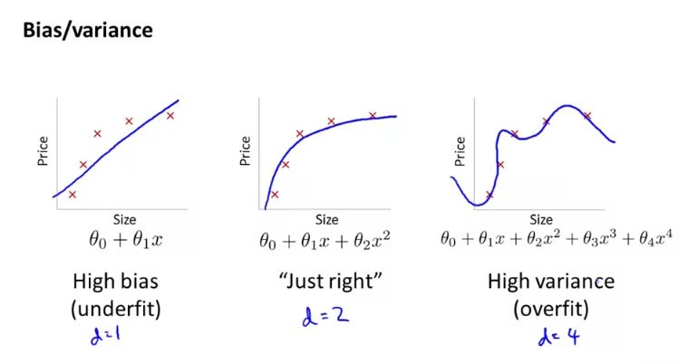
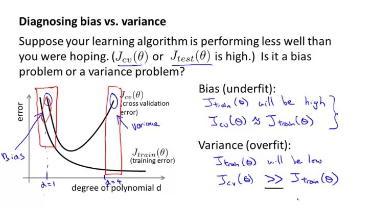
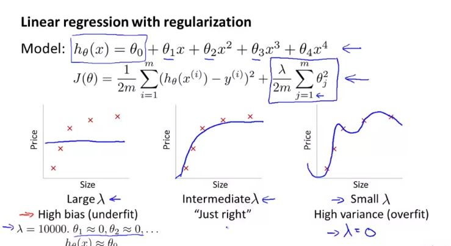
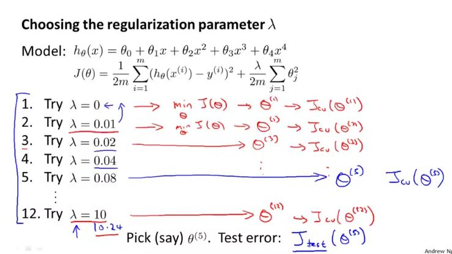
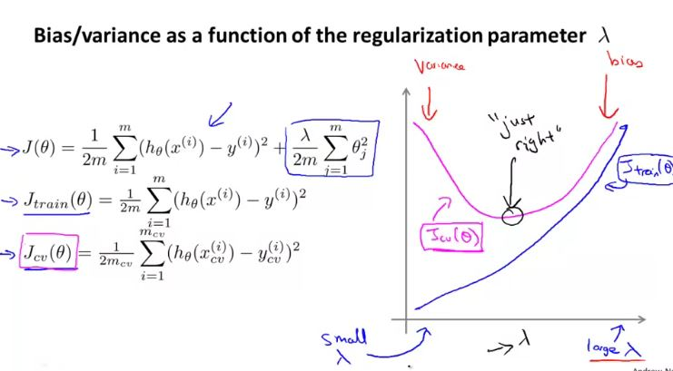
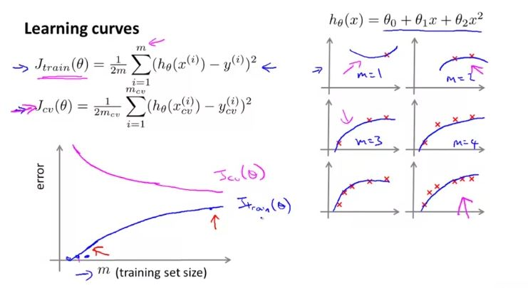
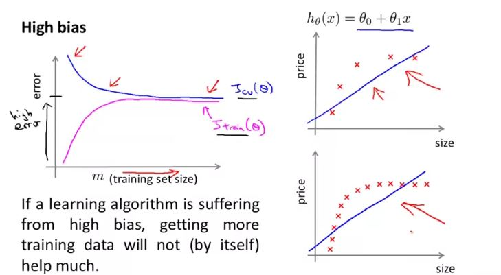
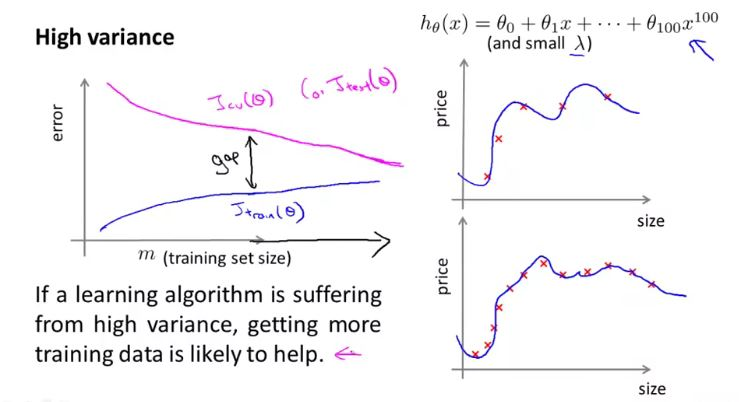
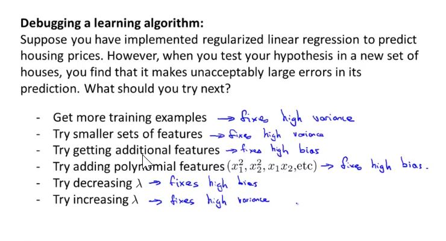
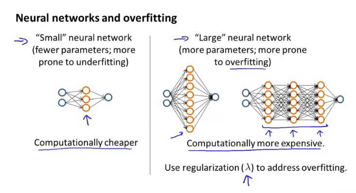

## Diagnosing Bias vs Variance

- High Bias - Underfit
- High Variance - Overfit

## Regularization and Bias/Variance

 In order to choose the model and the regularization term λ, we need to:

1. Create a list of lambdas (i.e. λ∈{0,0.01,0.02,0.04,0.08,0.16,0.32,0.64,1.28,2.56,5.12,10.24});
2. Create a set of models with different degrees or any other variants.
3. Iterate through the $\lambda$ and for each  $\lambda$ go through all the models to learn some $\Theta$.
4. Compute the cross validation error using the learned Θ (computed with λ) on the $J_{CV}(\Theta)$ **without** regularization or λ = 0.
5. Select the best combo that produces the lowest error on the cross validation set.
6. Using the best combo Θ and λ, apply it on $J_{test}(\Theta)$ to see if it has a good generalization of the problem.

## Learning Curves

 

## Deciding what to Do Next Revisited

