## Building a Spam Classifier

### Prioritizing what to work on 

Given a data set of emails, we could construct a vector for each email. Each entry in this vector represents a word. The vector normally contains 10,000 to 50,000 entries gathered by finding the most frequently used words in our data set.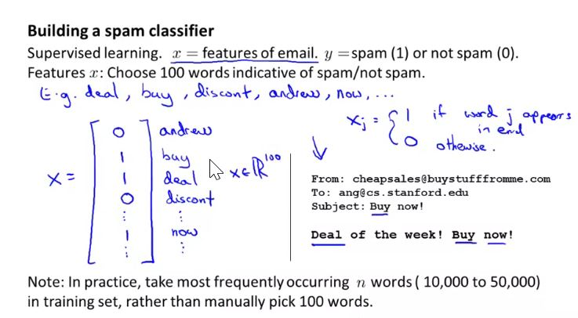

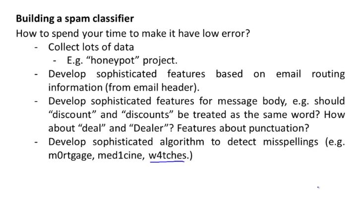

It is difficult to tell which of the options will be most useful. For example collecting lots of data doesn't always work. Similarly designing algorithm to detect misspelling may also not work.

### Error Analysis

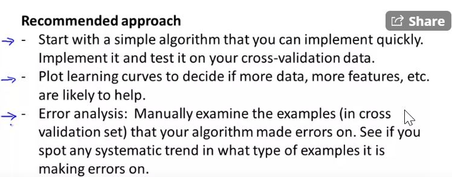

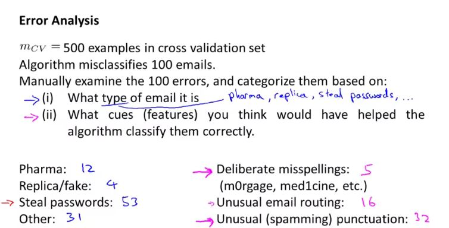

- By manually checking the type of email, one may find out that our classifier is working poorly on email that tries to steal password, so we can find some features that are particular to those emails and add them to our model. We could also see how classifying each word accordingl to its root changes our error rate.
- Similarly, you may find out that it would be prudent to look for unusual punctuation instead of deliberate misspelling to improve the classifier.

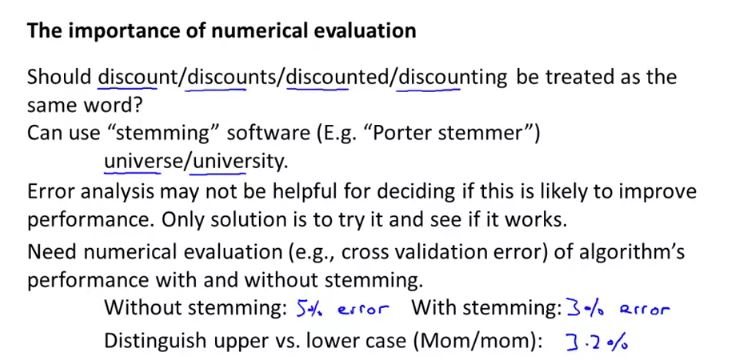

If we use stemming and get a 3% error rate instead of 5%, then we should definitely add it to our model. 

## Handling Skewed Data

### Error Metrics for Skewed classes

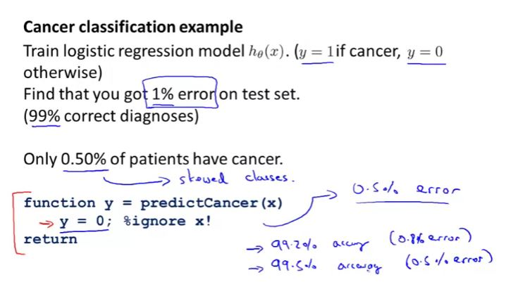

Given that only 0.5% of patients have cancer, 1% error rate is very high. if you simply create a method which returns 0 for each case (i.e. no one has cancer), then we will have 0.5% error rate which is higher than the ML algorithm.

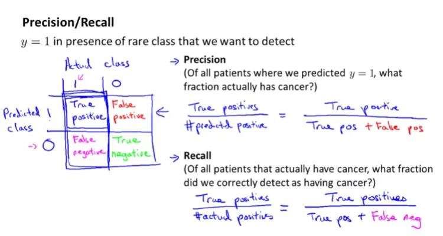

Note: For the simple method as described earlier, recall will be 0. if a classifier has higher precision and higher recall, then classifier is working correctly.

### Trading Off Precision and Recall

- Predicting y = 1 (cancer) only if very confident. meaning:

  $ h_\theta(x) \geq 0.7 $

  $ h_\theta(x) \leq 0.7 $

- Predicting y = 1 (cancer) even when we are not confident so as to avoid false negatives.

  $ h_\theta(x) \leq 0.3 $

  $ h_\theta(x) \leq 0.3 $

Here 0.7 and 0.3 is threshold.

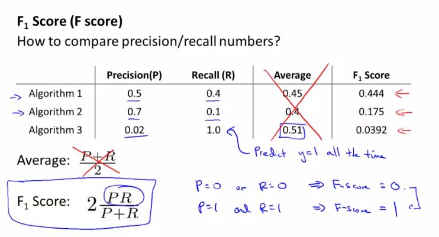

## Using Large Data Sets

### Data for Machine Learning

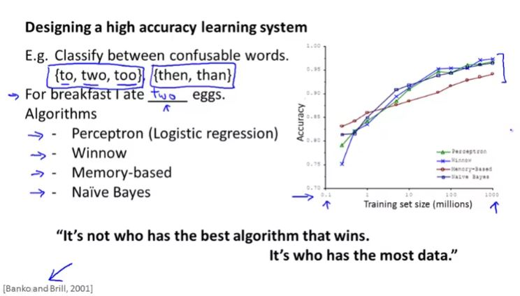

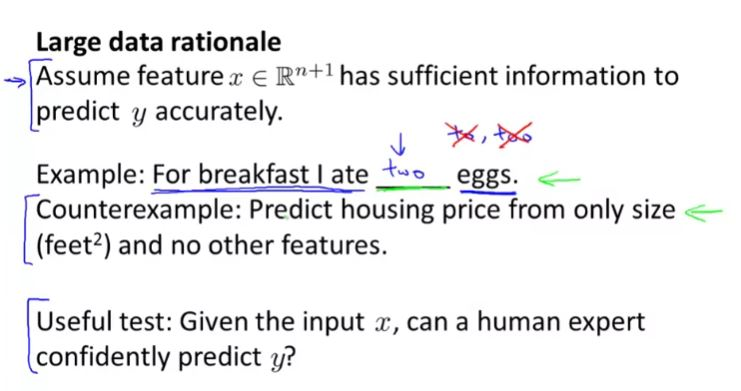

Larger no of feature will resolve high bias and having very large training set will resolve high variance.

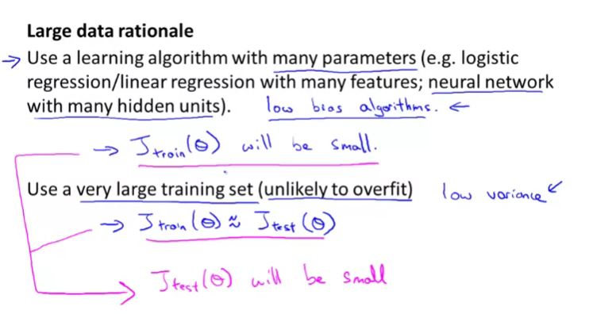

