## Motivation I: Data Compression

### Dimensionality Reduction

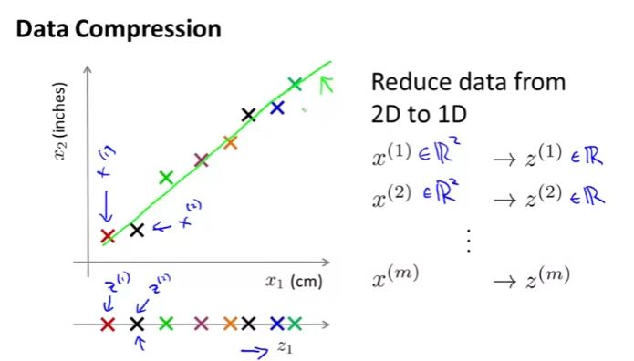

The reason why the graph is not completely straight is that the data is rounded off to the nearest integer. Dimensional reduction allows ourselves to approximate the original data set by projecting all of our original examples onto the green line, after which we only need one number.

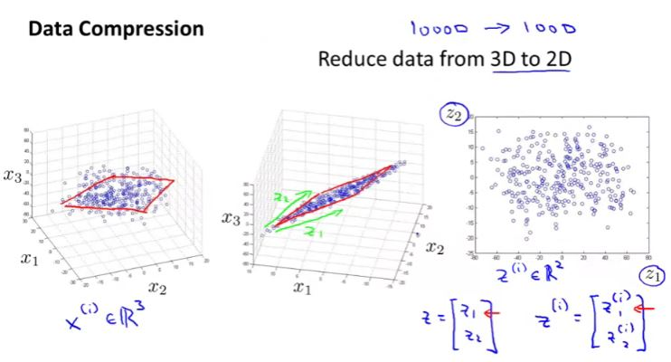

## Motivation II: Data Visualization

Given the huge number of features, that a dataset may have, it is very difficult to visualize the dataset to get the sense of the data. To mitigate this issue, we can use dimension reduction. 

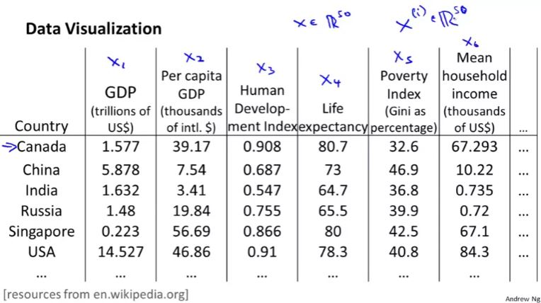

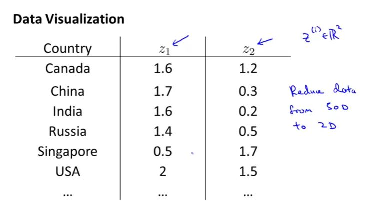

When you reduce the dimension, lets say from 50D to 2D, it turns out that it does not ascribe a particular meaning to the new feature. You may get the sense of this by plotting the data with 2D as shown

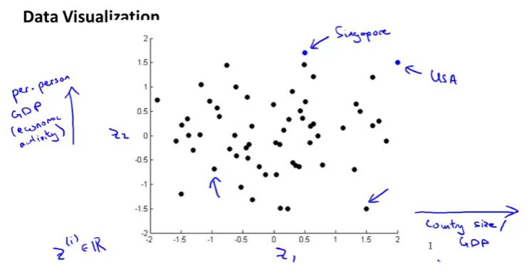

## Principal Component Analysis

### PCA Problem Formulation

What PCA does is it tries to find a lower dimensional surface or a line onto which to project the data so that the sum of squares of these little blue line segments is minimized. 

The length of these blue line segments are also called the projection error.

Before applying PCA, mean normalization and feature scaling should be implemented.

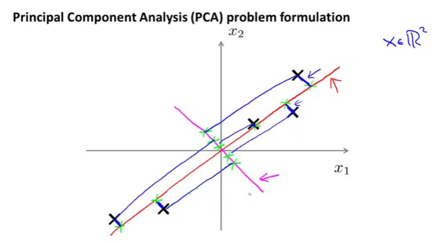

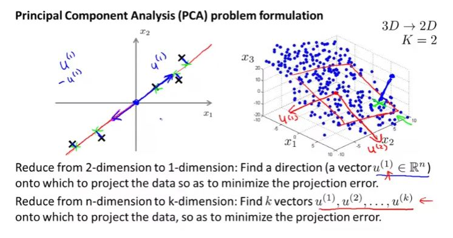
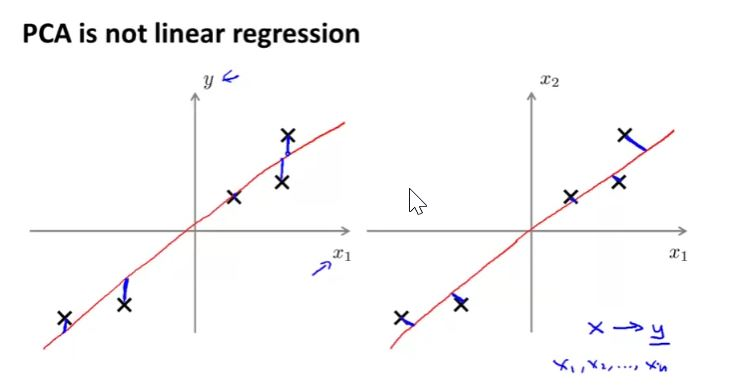

## PCA Algorithm

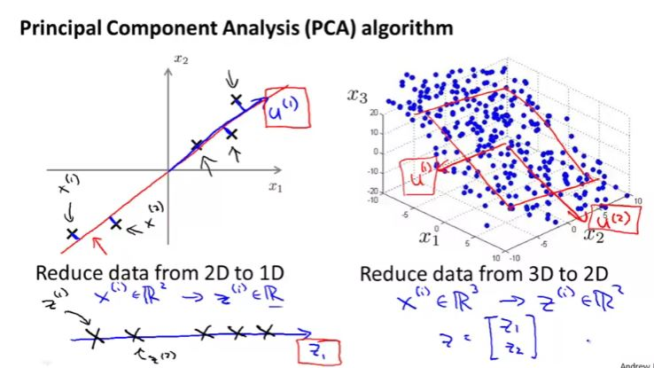

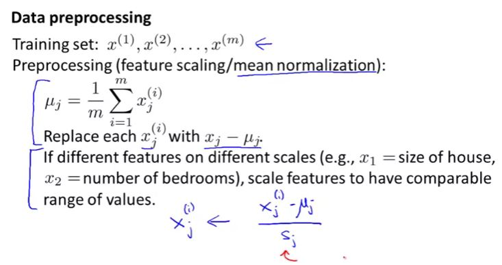

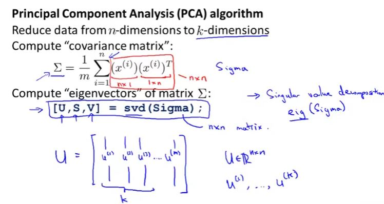

svd method in octave will return U matrix which will also have m columns, you may select first k features for the dimensional reduction.

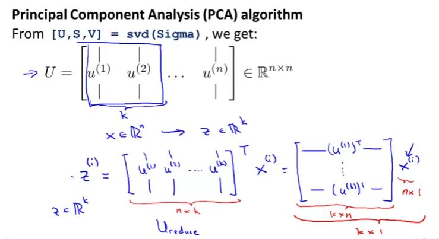

### PCA Algorithm Summary

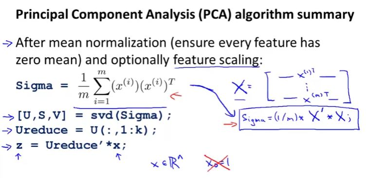

## Applying PCA

### Reconstruction from Compressed Representation

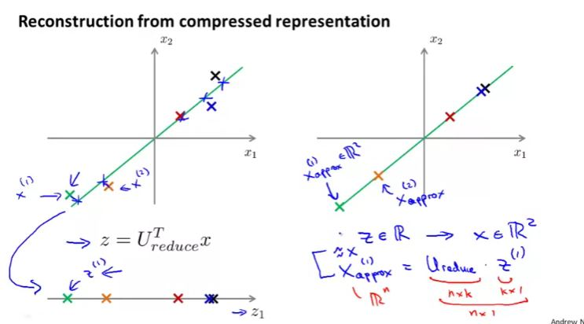

### Choosing the number of principal components

Generally K is chosen in such a way that 85% - 99% variance is retained

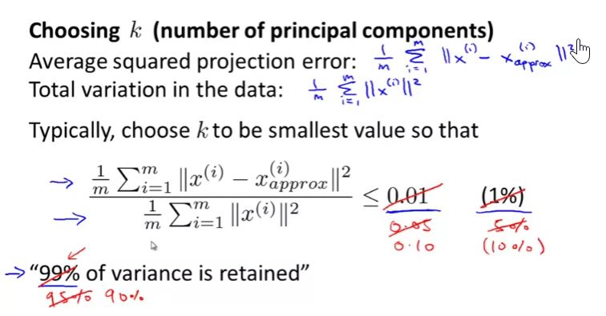

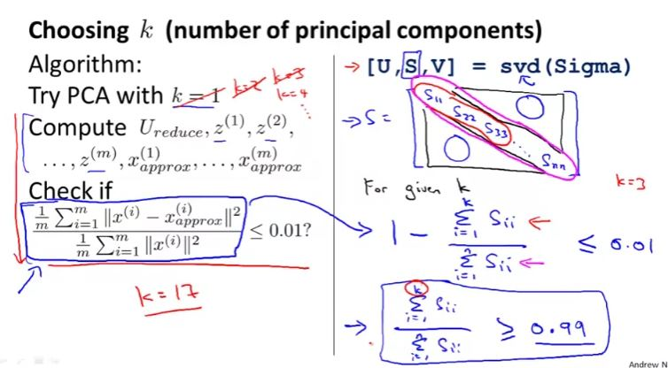
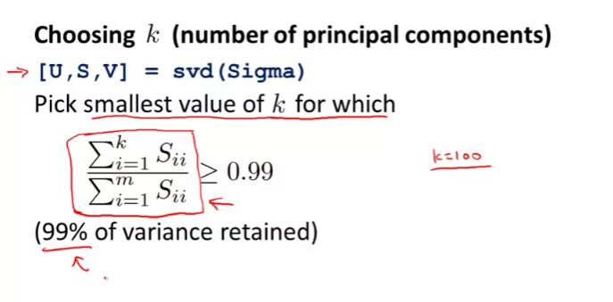

### Advice for applying PCA

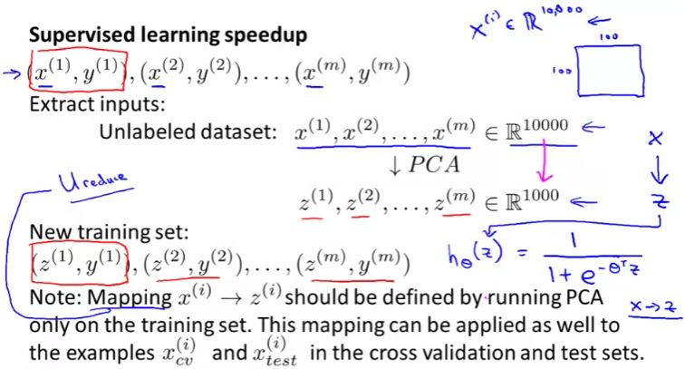

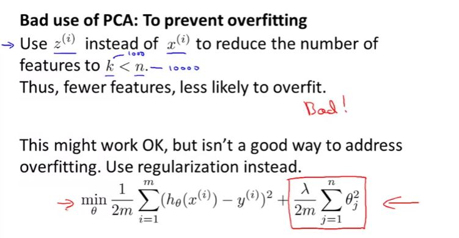

Using PCA for overfitting is not recommended as it reduces the dimension of data without knowing the values of output data i.e. y. it throws away some valuable information.

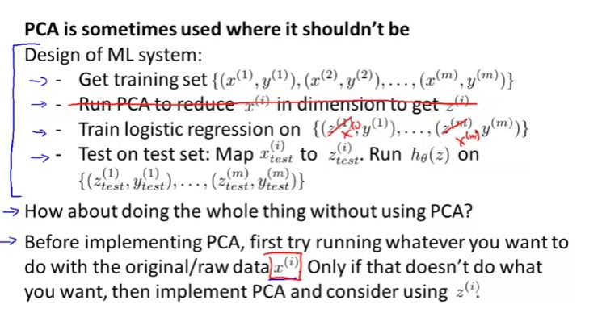

