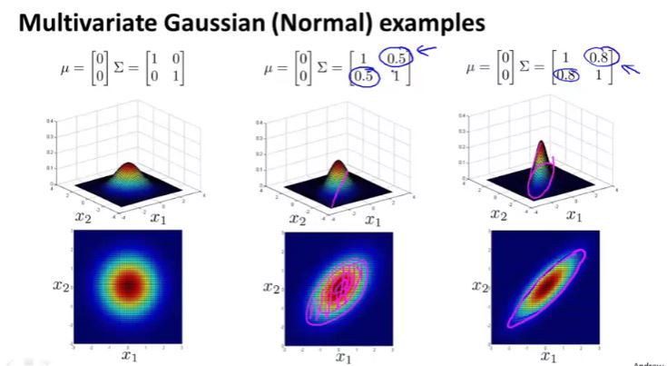
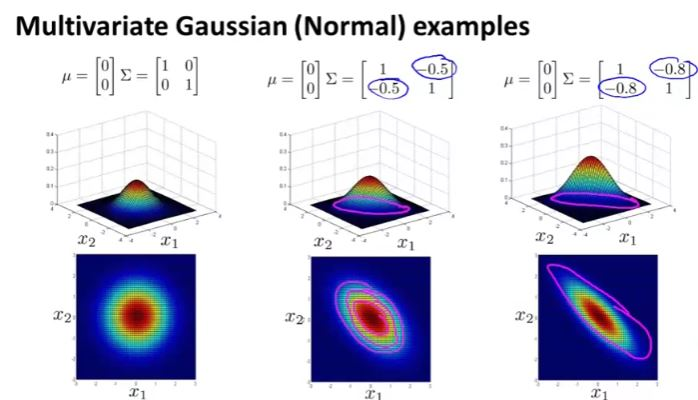

## Density Estimation

### Problem Motivation

Given the training set, we are going to build a model $P(x)$ i.e. a model for the probability of x, where x are these features of say aircraft engine.

 

  

### Gaussian Distribution

This is also called the normal distribution.

### Algorithm

 

Given the dataset $x^1, x^2, x^3, ..., x^m$, wherein each of these datasets denotes a feature of an user i.e.  $x^1$ is user 1 and so on. Now for $x^1$, there are multiple features such as $x_1, x_2, x_3, ..., x_n$ 

so we get, 

$ \mu_2 = \frac{1}{m}[x_2^1+x_2^2+x_2^3+...+x_2^m] $ 

## Building an Anomaly detection system

### Developing and evaluating Anomaly detection system

### Anomaly detection vs supervised learning

### Choosing what features to use

Choose features that result in a bell curve in histogram, you can also convert features to create a more bell shape curve as described in the image below.

### Multivariate Gaussian Distribution

As you can see from above picture, even if P(x1) and P(x2) is higher than epsilon, you can easily deduce that taking both into account, it seems like an anomaly. i.e. it is highly unlikely that memory use will be that high with such low CPU load no matter what individual probability distribution tell.

We can infer that probability regions (concentric circle) does not paint real picture of the anomaly detection.

If you shrink sigma i.e. $ \sum$ then height increases and width of the bump diminishes.  

you can also sigma for features separately, for example in the following example, variance of the feature $x_1$ can be  changed to 0.6  while keeping variance of feature $x_2$ same. this shows that $x_2$ takes wider range of values compared to $x_1$ 

### Anomaly Detection using multivariate Gaussian Distribution

 

 Here m is no of example and n is no of features.

