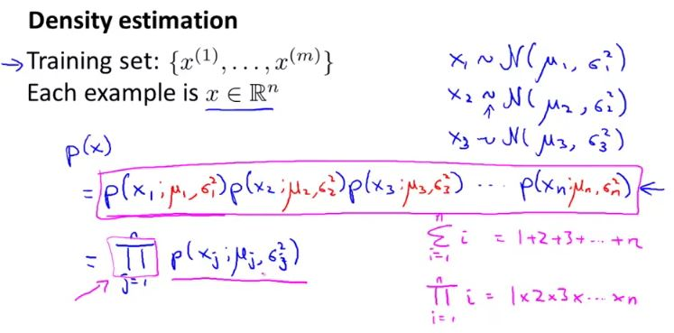

## Density Estimation

### Problem Motivation

Given the training set, we are going to build a model $P(x)$ i.e. a model for the probability of x, where x are these features of say aircraft engine.

 

  

### Gaussian Distribution

This is also called the normal distribution.

### Algorithm

 

Given the dataset $x^1, x^2, x^3, ..., x^m$, wherein each of these datasets denotes a feature of an user i.e.  $x^1$ is user 1 and so on. Now for $x^1$, there are multiple features such as $x_1, x_2, x_3, ..., x_n$ 

so we get, 

$ \mu_2 = \frac{1}{m}[x_2^1+x_2^2+x_2^3+...+x_2^m] $ 

## Building an Anomaly detection system

### Developing and evaluating Anomaly detection system

