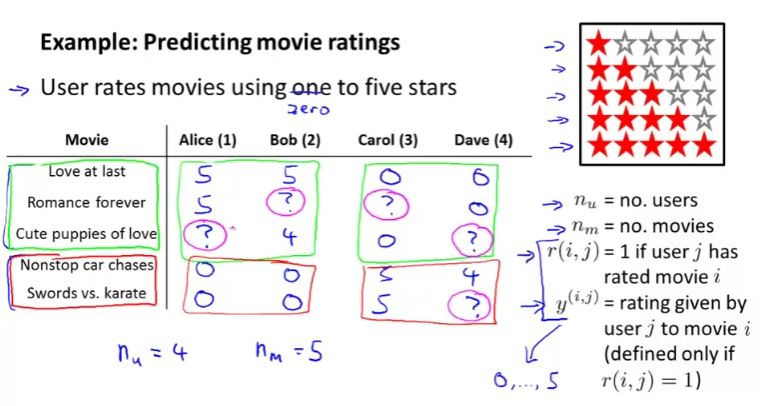
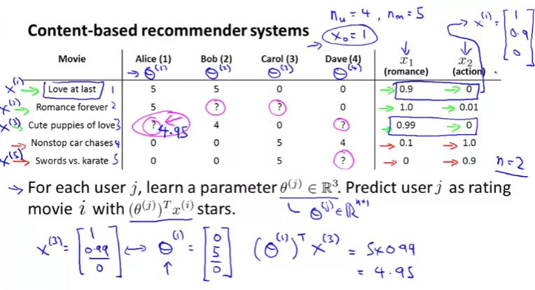
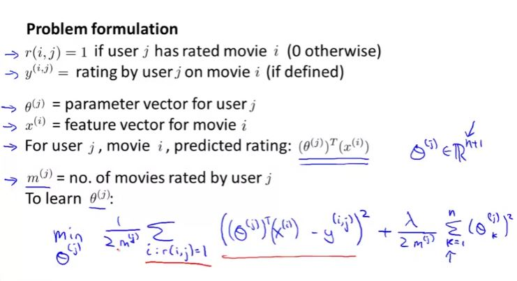
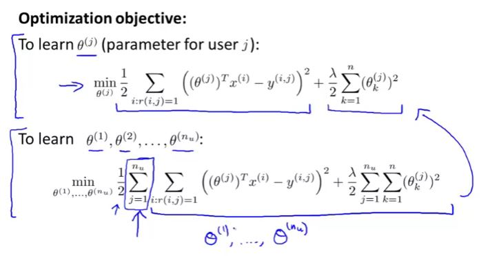
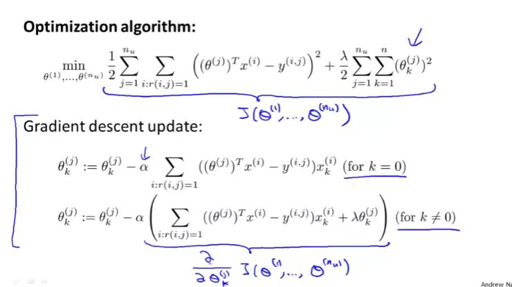
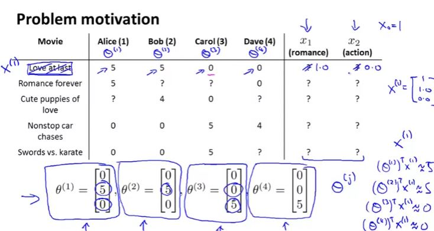
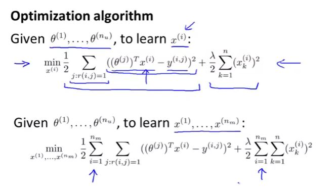
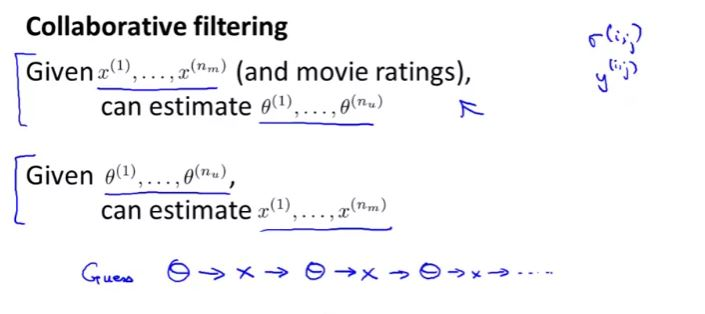
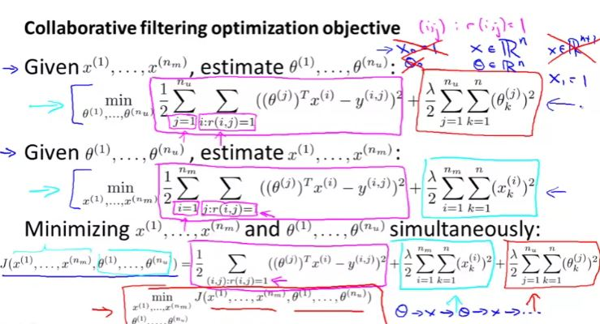
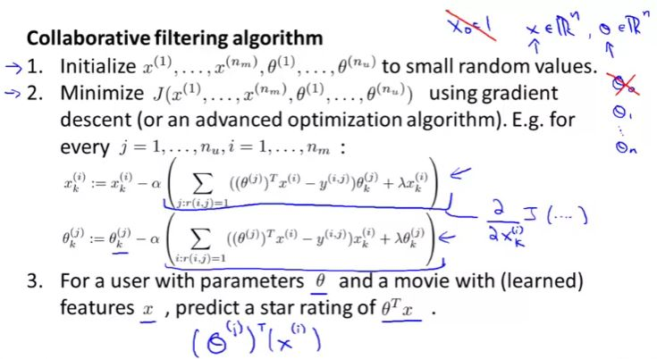

## Predicting Movie Ratings

### Problem Formulation

 

### Content Based Recommendations

To simplify the cost function we will omit $m_j$

### Collaborative Filtering

In the earlier chapters, we assume features parameter. To actually get the features, we need to work backwardly from the theta values for each users and find the feature which will result in the rating for movies for each users

### Collaborative Filtering Algorithm

There is no reason to hard code $x_0$ as 1 as the algorithm is also learning the features, if the problem requires $x_0$ to be 1, algorithm will accommodate that. That means that both $x$ and $\theta$ is $R^n$ matrix

